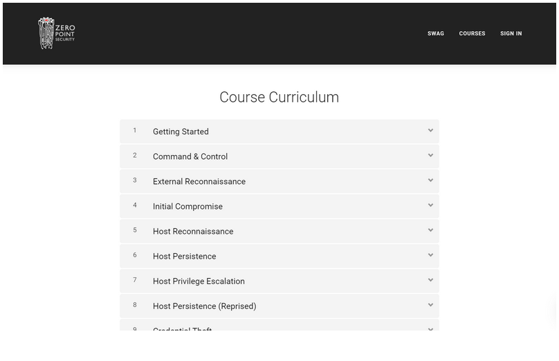
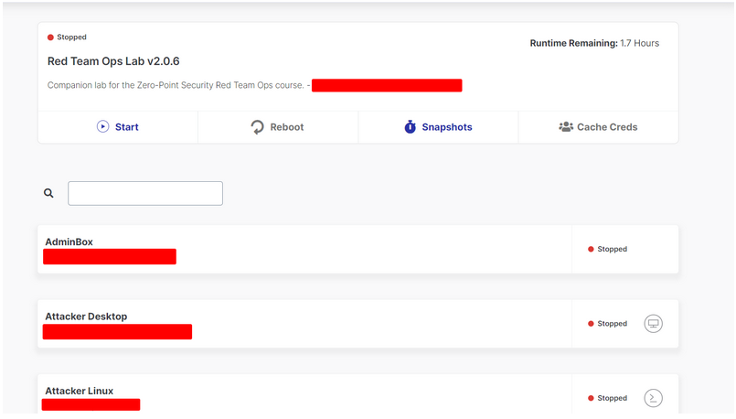
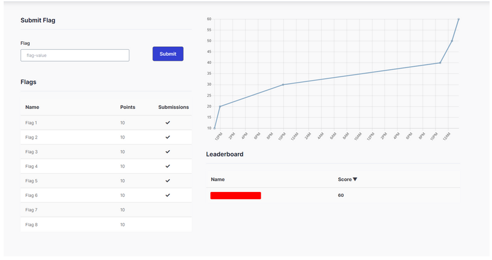

# CRTO Review

> 🛑
> Red Teaming is the process of using tactics, techniques and procedures (TTPs) to emulate a real-world threat, with the goal of measuring the effectiveness of the people, processes and technologies used to defend an environment.
<!--more-->
---

## Overview
`Red Team Operator` (RTO) course is entirely devoted to imparting the core ideas and skills needed to begin working in the red teaming industry. If you lean toward the offensive side, you've probably heard of this course before. The course begins with a strategy for conducting a red teaming engagement, and along the way, it will cover the many attack methods you will use in your actual engagement, including the whole attack lifecycle. Together with the techniques, you will get hands-on experience with new tactics to get around some security measures as well as backup options. This certification is a practical exam that test a candidate's aptitude for simulating actual attack scenarios and assessing the system's security.

RTO is the best-quality, most reasonably priced course available for red teaming. `RastaMouse`, the course's creator, aims to provide readers with high-level information that is brief. You will without a doubt enjoy the adventure of this course, which includes the many modules and, more importantly, the exam. Employers accept CRTO certification as proof of a person's red teaming abilities and expertise.

## Course Structure
The course is excellent in general; I ended up utilizing it as a guide in basically every internal pentest and red team engagement. So anyone with the entry level or intermediate level can enroll the course and enjoy the journey. The course is concise and well organized with the different Techniques, Tactics and Procedures (TTPs). Here, you will get a chance to get hands-on with real world implementation.  

The finest aspect of this course is frequently it is updated when new tools and techniques are introduced. Also, there is a section in the course where you will learn how to alter the target machine's artifact-kit and resource-kit in order to get around AV for Cobalt Strike payloads. The main thing about Cobalt Strike (CS) is it is more customizable, so it will be much harder to detect, and can also be used to emulate the TTPs of particular APT in Red Team Engagement. 

To understand more about the course, you can visit the official page of [zeropointsecurity](https://training.zeropointsecurity.co.uk/courses/red-team-ops).

## Lab Experience
Lab is hosted on SnapLab with web portal using `Gaucamole Apache`, overall, it was a smooth experience for me.
All tools were provided on attacker machine and complete sandbox to protect Cobalt Strike license. Candidate need to apply all the concepts learned in the course. It isn't straight forward, but requires the candidate to think critically and come up with innovative solutions. I recommend spending `more times on labs`, to assure yourself that you have good hands-on with Cobalt Strike before scheduling the exam. 

Below you can see how lab dashboard looks like.

## Pricing
Compare a lot of other certifications and red teams trainings, CRTO is very affordable. You can purchase the whole course and just the exam. Another thing to mention of the course is you have lifetime access to the course material and its future updates. 

For more detail about the course, you can visit [here](https://training.zeropointsecurity.co.uk/courses/red-team-ops).

## The Exam
The student must emulate an adversary using the provided threat profile as a guide. Exam is 48hrs runtime, usual within a 4-day window. The exam VMs can be stopped at any time to preserve runtime, should an extended break be required. 
Each machine has a flag which must be submitted on the scoreboard as proof of progress. A student must submit at least 6 of 8 flags to pass the exam.

### My Exam Experience
My exam was set for 9:15 AM NPT. On the day of my exam, I got up two hours early, ate a substantial meal, got some fresh air, and listened to music to calm my nerves. I have my go-to notes, my cheat sheet, and a custom C2 profile all ready before the exam. 
> "If I had eight hours to chop down a tree, I'd spend the first six sharpening my axe," stated Abraham Lincoln once.

Similar to that, I immediately descended to sharpen my axe before diving headfirst into each exam. It didn't take me very long to pwn the 3/8 flags after honing my axe. But, after listing every method and concluding that I had tried them all for the fourth flag, I had to halt the exam because I was unsure of what I had missed. Then, I went to bed frustrated. Next day, I tried to examine and connect the things I had the following day. After making a mindset with notes and restarting the exam, I was able to completely defeat flag 4 after 24 hours of the third flag. Due to extensive enumeration and interlink, I was able to obtain flag 5 later on and flag 6 at 2:30 AM, which was the passing flag.

Now I had I've 19 hours left, so I stop the exam and went for bed. Next day, started my exam after 8-10 hours of work and tried really hard for last flag 2 for 10 hours straight but wasn't able to see the possible way to hack further. From here, I still have 9 hours left, and I've already got the enough points to pass the exam, so thought of not giving too much pressure anymore. 

After an hour of exam time, my time was up, and I received the certificate.

### Key for Success
First from the creator himself,

1. Don't miss even the `smallest of details` as you complete the course. You are unsure about the point of the exam at which you will require that.
2. Before the start of the exam, make your `arsenal` ready by testing in lab. So that you don't need to waste the exam time to check and fix the error.
3. Make a `cheat sheet` that you can use as a reference during the exam.
4. When you restarted your exam, all the constructed sessions would have come to an end, thus you would need to redo the attack chain to continue. As a tactic to retain persistence and minimize the hassle, think about installing a backdoor or `dumping credentials`.
5. If you tried the same thing again, and it didn't work, take a brief `rest`. Computers also require rest, so they can decide to return.
6. Try to keep the `backup` beacon, if one dies you can use another and organize your beacons, listener well because it soon gets messy based on my experience.
7. Take a break, have some drink and foods 48hrs is too much time.
8. Lastly, don't forget to take a pause, `document the path you took` and `commands` you executed for compromising the system, this will help you in case you lose the complete access or reboot labs.

## Kudos

Special thanks go out to `Keoin Gurung`, who motivated me to pursue this certification, and `Abartan Dhakal` for giving me a platform and supporting me all along the way.

Furthermore, a special thanks to `Rastamouse` the individual.

## Closing Thoughts

Lastly, I just want to say that the whole certificate was my excellent choice to develop my skills in the field of red teaming and demonstrate my technical skill with critical thinking abilities. I really appreciate Rasta's presentation of information, and can personally say that I really loved this course material and will be using this as a reference for my further Red Teaming Engagements.

Ok final words for sure, if you really wants to gain real red teaming skill, wants to make hands dirty on Cobalt Strike tool than I would highly recommend this course to you.

