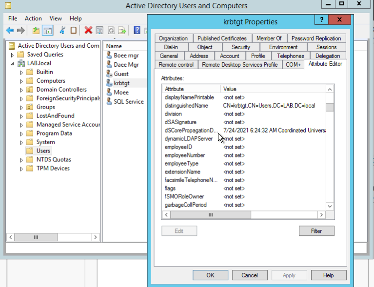

# LDAP Enumeration

I will describe the `ldap` protocol in detail and manually to enumerate it precisely especially for penetration testers.
<!--more-->

## Lightweight Directory Access Protocol (ldap): 389
Basically `ldap` is a software protocol for enabling anyone to locate organizations, individuals, and other resources such as files and devices in a network. It is used to query a database or directory type of service.
A common example is a corporate environment with an Active Directory(AD) server that manages user accounts of the entire organization. End devices such as desktop computers need to query the AD server each time a user is attempting to log in to that desktop computer. 
This is actually the Directory access protocol.

**Default port:** 389 AND 636(ldaps). Global Catalog(LDAP in ActiveDirectory) is available by default on ports 3268, and 3269 for LDAPS.
```vim
PORT 	STATE 	SERVICE REASON
389/tcp open 	ldap syn-ack
636/tcp open 	ldapssl
```
## Introduction
`ldap` contains many object which have `Distinguished Name`. ldap is hierarchical i.e 
1. **Domain Component(DC)**
This is main domain name i.e. lab.local.
2. **Organizational Unit(OU)**
This is identified as folder created by administrator for managing the different units
3. **Common Name(CN)**
This is the name given to the objects like username, groupname, computername etc. Like CN=krbtgt, CN=Moee in our below examples.
	
For eg:- 
`CN=Moee , OU=users, OU=LAB, DC=Moee, DC=lab, DC=local`



In order to view the attributes we first need to enable `advanced features` in the `view` option.


## Basic Enumeration
We can do enumeration using `nmap-script`,`ldapsearch`.
### nmap
Sometimes using `ldapsearch` requires some high level authentication i.e. username/passwd during which we can use `Nmap-script` to enumerate hostname details for `ldap` enable protocol.
```bash
root@gr4n173:~$ sudo nmap -n -sV --script "ldap* and not brute" -p 389 10.10.37.181 
```
### ldapsearch
**1. To find the `actual domain`**
```bash
ldapsearch -x -h 10.10.37.181  -s base namingcontexts
where -x= simple authentication
	  -b= specify base
	  -h= LDAP Server	  
```
**2. To find the details with `base`**
```bash
ldapsearch -x -h 10.10.37.181 -s sub -b 'DC=LAB,DC=local'
```
**3. To find only related to `objectClass`**
1. ldapsearch **Users**

When objectClass is Users which will extract all the users associated. `sAMAccountName` is the filter to be used based on the result or required.
```bash
ldapsearch -h 10.10.37.181 -x -b "DC=LAB,DC=local" '(objectClass=Users)' sAMAccountName
````
**Interesting attributes:-**
- sAMAccountName
- userPrincipalName
- memeberOf(groups)
- badPwdCount(login failed)
- lastLogoff( timestamp)
- lastLogon(timestamp)
- pwdLastSet(timestamp)
- logonCount

2. ldapsearch **Groups**
When objectClass is grouped to extract all the groups available.
```bash
ldapsearch -h 10.10.37.181 -x -b "DC=LAB,DC=local" '(objectClass=group)' sAMAccountName | grep sAMAccountName
```
3. ldapsearch **Computers**
When objectClass is a computer associated with a certain DC.
```bash
ldapsearch -h 10.10.37.181 -x -b "DC=LAB,DC=local" '(objectClass=computer)' sAMAccountName | grep sAMAccountName
```
Interesting attributes:-
- name (NetBIOS Name)
- dNSHostname(FQN)
- operatingSystem
- operatingSystemVersion
- servicePrincipalName(SPN running services)

We can do more `ldapsearch` based on `ObjectClass`. But, now I would like to introduce the some useful features of microsoft i.e. `extensions to LDAP` through OID( Object Identifier). That can be combined with `ldapsearch` and get the list of Domain admin users.
```bash
ldapsearch -h 10.10.37.181 -x -b "DC=LAB,DC=local" "(&(objectClass=user)(memberof:OID<1.2.840.00989498.990:=CN=Domain Admins, CN=Users, DC=Moee, DC=lab,DC=local))" sAMAccountName | grep sAMAccountName
```

### Other funs with OIDs
1. To find the user with `unconstrained delegation`. Unconstrained Delegation itself is a huge topic, so I will try to cover it later on. But for now just remember there is no any rules or bind constrain in uncontrained delegation and can compromise the system if system have `unconstrained delegation`.
```bash
ldapsearch -h 10.10.37.181 -x -b "DC=Moee, DC=LAB,DC=local" "(&(&(objectCategory=person)(objectClass=user)(userAcccountControl:<1.2.840.00989498.990>:=524288))"
```
2. To find a computer with unconstrained delegation.
```bash
ldapsearch -h 10.10.37.181 -x -b "DC=Moee, DC=LAB,DC=local" "(&(&(objectCategory=computer)(objectClass=computer)(userAcccountControl:<1.2.840.00989498.990>:=524288))"
```
3. Query GPO(Group Policy Object) name and locations
```bash
ldapsearch -h 10.10.37.181 -x -b "DC=Moee, DC=LAB,DC=local" "objectClass=groupPolicyContainer" displayName gPCFileSysPath
```


## Resources
1. https://en.wikipedia.org/wiki/Lightweight_Directory_Access_Protocol
2. https://docs.ldap.com/ldap-sdk/docs/tool-usages/ldapsearch.html
3. https://devconnected.com/how-to-search-ldap-using-ldapsearch-examples/
4. https://github.com/ropnop/windapsearch


