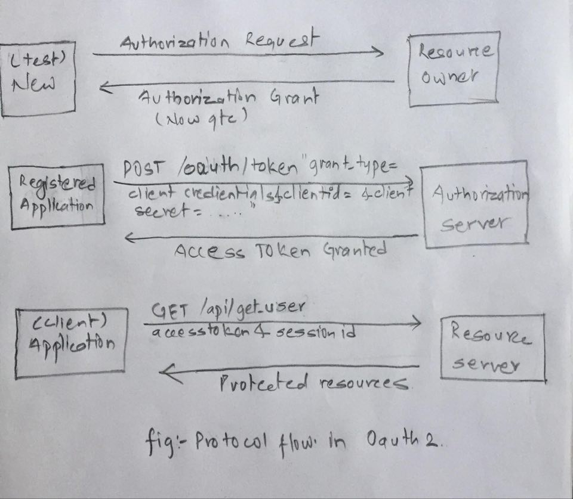

# OAuth 2

Here I will explain detail about the OAuth 2 .
<!--more-->

------

### Introduction

OAuth 2 is an authorization framework that enables applications to obtain limited access to user accounts on HTTP Service like Google, Facebook, GitHub etc. In other sense, it is a protocol that allow a user to grant the access to their resources on one site, to another site without having to expose their credentials.

Let's dive deep into OAuth 2 with the actual work flow involved in it. Basically there are four roles involved in it.

**OAuth 2 Roles:-**

* Resource Owner
* Client
* Resource Server
* Authorization Server

**Resource Owner: User**

An entity capable of granting the access to the protected resources. It is actually a *user* who authorize the access to their *application*. Typically this is an end-user.

**Client: Application**

An client is the *application* which wants to access the user's account. To access the protected account it must be authorized by user and authorization must be valid with the Authorization server i.e API .

**Resource/Authorization Server: API**

Resource Server is hosting the protected resources of certain user where as Authorization Server verify the identity of *user* and providing the access_token to the *application* for authorization.

### Workflow of OAuth 2

     +--------+                               +---------------+
     |        |--(1)- Authorization Request ->|   Resource    |
     |        |                               |     Owner     |
     |        |<-(2)-- Authorization Grant ---|               |
     |        |                               +---------------+
     |        |
     |        |                               +---------------+
     |        |--(3)-- Authorization Grant -->| Authorization |
     | Client |                               |     Server    |
     |        |<-(4)----- Access Token -------|               |
     |        |                               +---------------+
     |        |
     |        |                               +---------------+
     |        |--(5)----- Access Token ------>|    Resource   |
     |        |                               |     Server    |
     |        |<-(6)--- Protected Resource ---|               |
     +--------+                               +---------------+

Let's take an example to explain the real work flow involved in OAuth 2.

1. Authorization Request  
I have taken a new user 'test' and request the resource owner **qtc** user.

2. Authorization Grant  
By exploiting the contact form user *test* will grant authorization by user *qtc* using the __code__.

3. Authorization Grant  
Now I am into user **qtc** and requesting access-token presenting an authorization grant to the authorization server.

4. Access Token  
Authorization server authenticates the client(**application**) that I have used and validates the authorization grant, and if valid , issues an access token that to user which will be invalid after 600 sec.

5. Access Token  
Now client (**application**) request the protected resources using above *access_token* and will be authenticated by server.

6. Protected Resources    
After verifying the **access_token** and **sessionid** of that user Resource server will provide the protected resources.

Firstly, let's talk about the basic topic involved in OAuth 2.

#### Authorization Grant
Authorization grant is a credentials representing the resource owner's authorization used by the client to obtain an access token. There are four types of grant:- implicit, authorization code, resource owner password credentials and client credentials.

#### Authorization Code 
   The authorization code is obtained by using an authorization server as an intermediary between the client and resource owner.  Instead of requesting authorization directly from the resource owner, the client directs the resource owner to an authorization server which in turn directs the resource owner back to the client with the authorization code.
   
#### Client Credentials 
Client credentials can be used as authorization grant  when authorization scope is limited to the protected resources under the control of the client. It is used as authorization grant typically when the client is acting on its own behalf(the client is the resource owner) or requesting to access the protected resources. 

#### Access token
Access token are the credentials with the combination of strings used to access protected resources.

#### Client Registration 
Before initiating the protocol, the client registers with the authorization server. The means through which the client registers with the authorization server are beyond the scope of this specification but typically involve end-user interaction with an HTML registration form. When supported by the authorization server, registration can rely on other means for establishing trust and obtaining the required client properties (e.g., redirection URI, client type).

1. Client Type  
Basically there are two client type based on their ability to authenticate securely with authorization with authorization server.  
      * Confidential Type
      	- Here application is capable of maintaining the confidentiality of their credentials or capable of secure client authentication using other means.
	  * Public Type
		  - Here application is incapable of maintaining the confidentiality of their credentials or incapable of secure client authentication using any other means.

2. Redirection URI   
It redirects the user-agent of service after an authorization code is granted. For e.g I used my local server to see the response from the request I send in a certain field like contact form(vulnerable field) and finally got the **sessionid**.

Below you can see the real work flow involve in Oauth2 and it's really Oouch...

