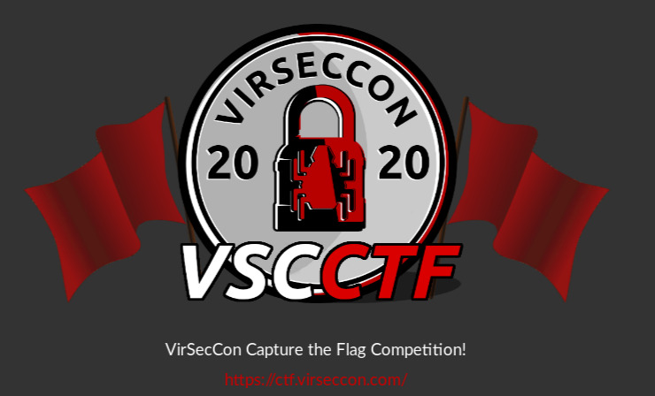
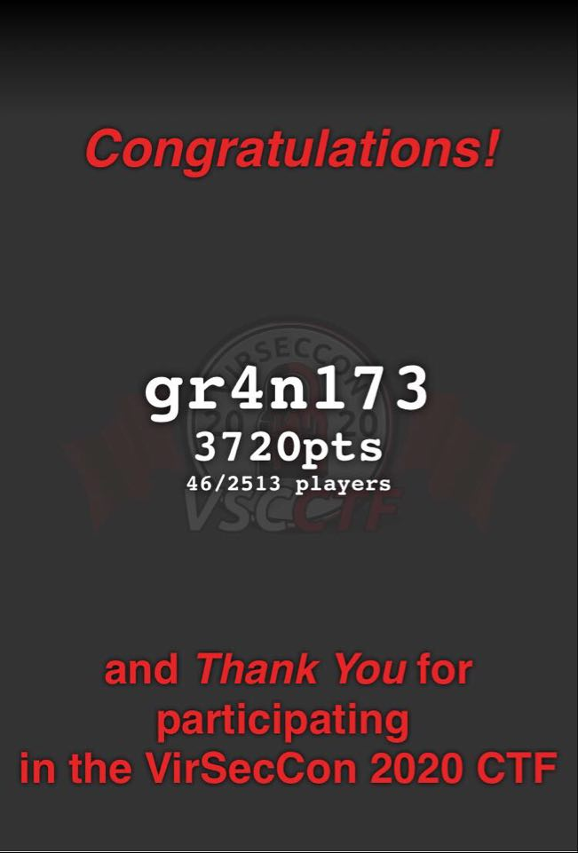

# VirSecCon2020

Virtual Security Conference known as VirSecCon2020 and my ranking in VSCCTF.
<!--more-->

## Introduction

As due to the outbreak of the Corona virus that start from late 2019 known as `COVID-19`every big National as well as International Cyber Security Conference was canceled. So In regard that, two well-renowned hackers [NahamSec](https://twitter.com/NahamSec) and [Heath Adams](https://twitter.com/thecybermentor)(also known as The Cyber Mentor[TCM]) organized a Virtual Security Conference (VirSecCon2020). The conference was conducted free and all the sponsors funds from this conference goes to [LLSusa](https://www.lls.org). Conference was full of talks from renowned and most reputed hackers all around the world. 

### Talks:-

[TomNomNom](https://twitter.com/TomNomNom):- **Bug Bounties With Bash**

[d0nutptr](https://twitter.com/d0nutptr):- **Practical Exploitation of Insecure Randomness on V8**
  
[zseano](https://twitter.com/zseano):- **Unique mindset – Hacking with zseano**

[uraniumhacker](https://twitter.com/uraniumhacker):- **Protecting your internal assets from enterprise misconfigurations**

[Stokfredrik](https://twitter.com/stokfredrik):- **From NOOB to MVH: What does it really take**

[ChloeMessdaghi](https://twitter.com/ChloeMessdaghi):- **Hacker Rights**

[niden](https://twitter.com/niden):- **Try Harder? Keep Trying! Demystifying the OSCP & OSCE Certifications**

[b3nac](https://twitter.com/B3nac):- **Android Hacking**

[erbbysam](https://twitter.com/erbbysam):- **Hostnames: Trials, Tribulations & VHost Misconfiguration**

[EthicalHacker](https://twitter.com/ethicalhacker):- **IoT Hacking Basics – Fun with UPnP and a Smart Outlet**

[DawnIsabel](https://twitter.com/dawnisabel):- **iOS Recon with Radare2**

These talks was on April 4, 2020 in [Nahamsec](https://www.twitch.tv/nahamsec) twitch channel.

Before these talks i.e on April 3, 2020 they organized a Virtual Security Conference CTF (VSC CTF) which was fully helped and hosted by [John Hammond](https://twitter.com/_johnhammond). 

VSC CTF was live for 29.5 hours in [ctf.virseccon.com](https://ctf.virseccon.com/).

VSC CTF was divided into 9 Challenges and among them I was able to solve the below challenges which lend me to secure a rank among top 50 teams `rank 46/2513` with points 3720 pts.

## Challeges	
### [Steganography](https://gr4n173.github.io/2020/04/07/virseccon-ctf-steganography):

		- Stegosaurus
		- Winter Wonderland
		- Elessbe
		
	
### Scripting:

		- 2048
		- Pincode
		- Quick Run
		- Grammer
		- Loopback
		
### Binary:

		- Count Dracula
		- Buff The Barque
		
		
### Forensic:
		
		- I Lost My Password
		- Tragic Number
		- QUACK
		

### Miscellaneous

		- Hidden
		- Linux Kiosk
		- Catalias
		- Chasm
		- MissingCho
		
		

### Web

		- 10 Character Web Shell 	
		- GET Encoded
		- Sequelitis
		- GLHF
		- PHPJuggler
		- Magician 	
		- JaWT
		- MASK
		- Dairy Products
		- Irregular Expressions 	
		- Eyeless
		
### Cryptography 
	
		- Chief Executive Officer
		- Polybius
		- Classic
		
### Warmup 

### Social Media

I will be writting all the writeups of the challenges that I solved besides last two catageory which was the easy challenge. I would especially like tothank host of the VirSecCon CTF [John Hammond](https://twitter.com/_johnhammond) for providing a such an awesome platform.

Stay Updated with my blog.

Feedback are really appricated.

#COVID-19

#Stay_Safe

#quarantine

