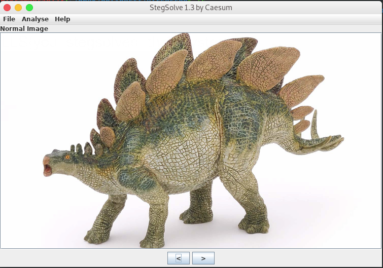
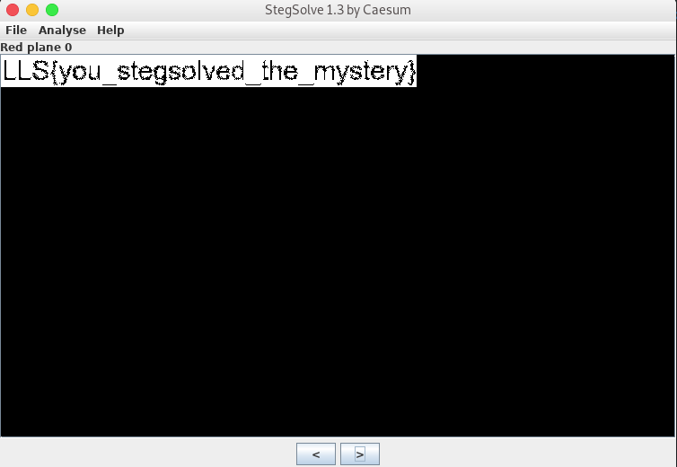

# VirSecCon CTF "Steganography Challenges"


Here I will explain the about steganography challenges that I solved and tools used.
<!--more-->

---
## Steganography

Steganography is the practice of concealing a file, message, image or video within another file, message, video or image. There are many tools that can be used in CTF to solve the steganography challenges such as Steghide, foremost, Stegsolve, Strings, Exiftool, Binwalk, Zsteg, Wavsteg, Stegsnow etc among these I only used 3 tools in VirSecCon CTF.


### 1. Stegosaurus 

#### Description [70]
Scientists are struggling with a new mystery: we thought the dinosaurs were gone, but this one has returned! Hmmm... can you solve this mystery?

File: [stegosaurus.png](public/images/stegosaurus.png)

Solution:
	I solved this challenge using stegsolve tool you can download it [here](https://github.com/eugenekolo/sec-tools/tree/master/stego/stegsolve/stegsolve)

```
root@gr4n173:~$ls
stegsolve.jar
root@gr4n173:~$java -jar stegsolve.jar
```

then stegsolve was opened.





then I got the flag finally and got the 70 points.





### 2. Winter Wonderland

#### Description [80]
It’s the holiday season! But hmm… they must be hiding something under all that cheer!
Download the file below.

File: [winter_wonderland.txt](public/files/winter_wonderland.txt)

Solution:

```
root@gr4n173:~# cat winter_wonderland.txt
Oh the weather outside is frightful	  	      		 	   
But the fire is so delightful    	  	      	      	   	   
And since we've no place to go   	   	    	 	     	      
Let It Snow! Let It Snow! Let It Snow!     		     	       	     
     	    	      	     		     	       	     	   	      
It doesn't show signs of stopping      	      	 	   	       	     
And I've bought some corn for popping   	       	  	       	   
The lights are turned way down low   	    	    	 	    	      
Let It Snow! Let It Snow! Let It Snow!	 	       	 	     	      
       	      	      		   	  	     	   	 	  
When we finally kiss goodnight       	   	   	 	     	   
How I'll hate going out in the storm! 	  	       	   	       	    
But if you'll really hold me tight    	 	     	      	  	  
All the way home I'll be warm   	       	    	 	 	      
    	  	   	  	     	   	  	      	       	  
The fire is slowly dying
And, my dear, we're still goodbying
But as long as you love me so
Let It Snow! Let It Snow! Let It Snow!

Oh! It doesn't show signs of stopping
And I've bought some corn for popping
and The lights are turned way down low
Let It Snow! Let It Snow! Let It Snow!

All the way home I'll be warm!
All the way home I'll be warm!

The fire is slowly dying
And, my dear, we're still goodbying
But as long as you love me so
Let It Snow! Let It Snow! Let It Snow!

Let It Snow! Let It Snow! Let It Snow!


```
I saw the word `snow` many times so used `stegsnow` tool.

```
root@gr4n173:~# stegsnow winter_wonderland.txt
LLS{let_it_snow_baby_let_it_reindeer}
```
This way I got the flag and got the 80 points.


### 3. Elessbe

#### Description [80]
Ah, bonjour mon bon ami! Bienvenue  à la capture du drapeau! J’ai entendu dire que vous étiez fan de la  stéganographie! Avez-vous déjà entendu parler d’un outil appelé zsteg?
Download the file below:

File: [elessbe.png](public/images/elessbe.png)

Solution: As from the challenge name 'Elessbe'= 'lsb' so I used the `zsteg` tool and got the least significant bits of the file using command below.

```
root@gr4n173:~# zsteg -a elessbe.png
file: Apple DiskCopy 4.2 image \376, 16842496 bytes, 0xff00 tag size, 0xff encoding, 0x0 format
b1,bgr,lsb,xy       .. text: "LLS{lsb_est_mon_bon_ami}"
b2,r,lsb,xy         .. file: 5View capture file
b2,r,msb,xy         .. file: VISX image file
b2,g,lsb,xy         .. file: 5View capture file
b2,g,msb,xy         .. file: VISX image file
b2,b,lsb,xy         .. file: 5View capture file
b2,b,msb,xy         .. file: VISX image file
b2,rgb,lsb,xy       .. file: 5View capture file
b2,rgb,msb,xy       .. file: VISX image file
b2,bgr,lsb,xy       .. file: 5View capture file
b2,bgr,msb,xy       .. file: VISX image file
b4,r,msb,xy         .. text: ["w" repeated 9 times]
b4,g,msb,xy         .. text: ["w" repeated 12 times]
b4,b,msb,xy         .. text: ["w" repeated 10 times]
b4,rgb,msb,xy       .. text: ["w" repeated 28 times]
b4,bgr,msb,xy       .. text: ["w" repeated 29 times]
b8,r,msb,xy         .. file: RDI Acoustic Doppler Current Profiler (ADCP)
b8,g,msb,xy         .. file: RDI Acoustic Doppler Current Profiler (ADCP)
b8,b,msb,xy         .. file: RDI Acoustic Doppler Current Profiler (ADCP)
b8,rgb,msb,xy       .. file: RDI Acoustic Doppler Current Profiler (ADCP)
b8,bgr,msb,xy       .. file: RDI Acoustic Doppler Current Profiler (ADCP)
b2,g,lsb,xy,prime   .. file: SoftQuad DESC or font file binary
b2,g,msb,xy,prime   .. file: VISX image file
b2,b,lsb,xy,prime   .. file: SoftQuad DESC or font file binary
b2,b,msb,xy,prime   .. file: VISX image file
b2,rgb,lsb,xy,prime .. file: 5View capture file
b2,rgb,msb,xy,prime .. file: VISX image file
b2,bgr,lsb,xy,prime .. file: 5View capture file
b2,bgr,msb,xy,prime .. file: VISX image file
b4,rgb,msb,xy,prime .. text: ["w" repeated 10 times]
b4,bgr,msb,xy,prime .. text: ["w" repeated 11 times]
b8,r,msb,xy,prime   .. file: RDI Acoustic Doppler Current Profiler (ADCP)
b8,g,msb,xy,prime   .. file: RDI Acoustic Doppler Current Profiler (ADCP)
b8,b,msb,xy,prime   .. file: RDI Acoustic Doppler Current Profiler (ADCP)
b8,rgb,msb,xy,prime .. file: RDI Acoustic Doppler Current Profiler (ADCP)
b8,bgr,msb,xy,prime .. file: RDI Acoustic Doppler Current Profiler (ADCP)
b2,r,msb,yx         .. text: ["U" repeated 18 times]
b2,rgb,msb,yx       .. text: ["U" repeated 12 times]
b4,r,msb,yx         .. text: ["w" repeated 8 times]
b8,rgb,msb,yx       .. file: RDI Acoustic Doppler Current Profiler (ADCP)
b2,rgb,msb,yx,prime .. text: "WUUUUUUU"
b4,rgb,msb,yx,prime .. text: ["w" repeated 16 times]
b2,r,lsb,XY         .. file: VISX image file
b2,r,msb,XY         .. file: 5View capture file
b2,g,lsb,XY         .. file: VISX image file
b2,g,msb,XY         .. file: 5View capture file
b2,b,lsb,XY         .. file: VISX image file
b2,b,msb,XY         .. file: 5View capture file
b2,rgb,lsb,XY       .. file: VISX image file
b2,rgb,msb,XY       .. file: 5View capture file
b2,bgr,lsb,XY       .. file: VISX image file
b2,bgr,msb,XY       .. file: 5View capture file
b4,r,msb,XY         .. text: ["w" repeated 28 times]
b4,g,msb,XY         .. text: ["w" repeated 28 times]
b4,b,msb,XY         .. text: ["w" repeated 28 times]
b8,g,msb,XY         .. text: ["?" repeated 8 times]
b8,rgb,msb,XY       .. text: "#m\r\rCMM3"
b1,r,lsb,XY,prime   .. file: MPEG ADTS, layer II, v1, 48 kHz, JntStereo
b1,g,lsb,XY,prime   .. file: MPEG ADTS, layer II, v1,  64 kbps, JntStereo
b2,r,lsb,XY,prime   .. file: VISX image file
b2,r,msb,XY,prime   .. file: SoftQuad DESC or font file binary
b2,g,lsb,XY,prime   .. file: VISX image file
b2,g,msb,XY,prime   .. file: SoftQuad DESC or font file binary
b2,b,lsb,XY,prime   .. file: VISX image file
b2,b,msb,XY,prime   .. file: SoftQuad DESC or font file binary - version 10922
b2,rgb,lsb,XY,prime .. file: VISX image file
b2,rgb,msb,XY,prime .. file: 5View capture file
b2,bgr,lsb,XY,prime .. file: VISX image file
b2,bgr,msb,XY,prime .. file: 5View capture file
b4,b,msb,XY,prime   .. text: "\"7233333"
b4,rgb,msb,XY,prime .. text: ["w" repeated 13 times]
b4,bgr,msb,XY,prime .. text: ["w" repeated 13 times]
b1,b,lsb,YX         .. file: Targa image data - RLE 58075 x 25368 x 24 +56227 +9435 - 13-bit alpha - top - reserved "\377\377\377\377\377\377\377\377\377\377\377\377\377\377\377\377\377\377\377\377\377\377\377\377\377\377\377\377\377"
b1,b,msb,YX         .. file: Targa image data - RLE 18395 x 50712 x 24 +56261 +9435 - 7-bit alpha - top - right - four way interleave "\377\377\377\377\377\377\377\377\377\377\377\377\377\377\377\377\377\377\377\377\377\377\377\377\377\377\377\377\377"
b2,r,lsb,YX         .. file: VISX image file (zero)
b2,r,msb,YX         .. file: SoftQuad DESC or font file binary
b2,g,lsb,YX         .. file: VISX image file (zero)
b2,g,msb,YX         .. file: SoftQuad DESC or font file binary
b2,b,lsb,YX         .. file: VISX image file (zero)
b2,b,msb,YX         .. file: SoftQuad DESC or font file binary
b2,rgb,lsb,YX       .. file: VISX image file
b2,rgb,msb,YX       .. file: 5View capture file
b2,bgr,lsb,YX       .. file: VISX image file
b2,bgr,msb,YX       .. file: 5View capture file
b4,r,lsb,YX         .. text: "wvEgTfeeUC!"
b4,g,lsb,YX         .. text: "wwveUUTC32"
b4,b,lsb,YX         .. text: "feTDOZBSDC2\""
b4,rgb,lsb,YX       .. text: "W4sG4sF\#@"
b4,rgb,msb,YX       .. text: ["3" repeated 12 times]
b4,bgr,msb,YX       .. text: ["3" repeated 12 times]
b8,r,msb,YX         .. text: ["?" repeated 8 times]
b8,g,msb,YX         .. text: ["?" repeated 8 times]
b8,b,msb,YX         .. text: ["?" repeated 11 times]
b8,rgb,msb,YX       .. text: ["?" repeated 24 times]
b8,bgr,msb,YX       .. text: ["?" repeated 25 times]
b1,rgb,lsb,YX,prime .. file: MPEG ADTS, AAC, v4 Main, surround + side
b1,bgr,lsb,YX,prime .. file: MPEG ADTS, AAC, v4 Main, 22.05 kHz, monaural
b2,rgb,lsb,YX,prime .. file: VISX image file
b2,rgb,msb,YX,prime .. file: SoftQuad DESC or font file binary - version 170
b2,bgr,lsb,YX,prime .. file: VISX image file
b2,bgr,msb,YX,prime .. file: SoftQuad DESC or font file binary - version 170
b4,r,msb,Xy         .. text: ["w" repeated 9 times]
b4,g,msb,Xy         .. text: ["w" repeated 12 times]
b4,b,msb,Xy         .. text: ["w" repeated 10 times]
b1,r,lsb,Xy,prime   .. file: AIX core file fulldump 32-bit
b1,g,lsb,Xy,prime   .. file: MPEG ADTS, layer II, v1, JntStereo
b1,b,lsb,Xy,prime   .. file: AIX core file fulldump 32-bit
b4,r,lsb,yX         .. text: "4UVVfEvTgwx"
b4,g,lsb,yX         .. text: "#34EUUVgwwx"
b4,b,lsb,yX         .. text: "2!4DEVffgx"
b1,rgb,lsb,xY       .. file: dBase III DBT, version number 0, next free block index 4294967295
b1,rgb,msb,xY       .. file: dBase III DBT, version number 0, next free block index 4294967295
b1,bgr,lsb,xY       .. file: dBase III DBT, version number 0, next free block index 4294967295
b1,bgr,msb,xY       .. file: dBase III DBT, version number 0, next free block index 4294967295
b2,r,lsb,xY         .. text: ["U" repeated 28 times]
b2,r,msb,xY         .. text: ["U" repeated 14 times]
b2,g,lsb,xY         .. text: ["U" repeated 28 times]
b2,g,msb,xY         .. text: ["U" repeated 14 times]
b2,b,lsb,xY         .. text: ["U" repeated 30 times]
b2,b,msb,xY         .. text: ["U" repeated 14 times]
b2,rgb,lsb,xY       .. text: ["U" repeated 84 times]
b2,rgb,msb,xY       .. text: ["U" repeated 42 times]
b2,bgr,lsb,xY       .. text: "UUUUUUUUUUUUUUUUUUUUUUUUUUUUUUUUUUUUUUUUUUUUUUUUUUUUUUUUUUUUUUUUUUUUUUUUUUUUUUUUUUUUI$"
b2,bgr,msb,xY       .. text: ["U" repeated 42 times]
b4,r,msb,xY         .. text: ["w" repeated 28 times]
b4,g,msb,xY         .. text: ["w" repeated 28 times]
b4,b,msb,xY         .. text: ["w" repeated 28 times]
b4,rgb,msb,xY       .. text: ["w" repeated 84 times]
b8,g,msb,xY         .. text: ["?" repeated 8 times]
b2,r,lsb,xY,prime   .. text: "UUUUU[bk"
b2,rgb,lsb,xY,prime .. text: "UUUUUUUUUUUUUUUUX"
b2,rgb,msb,xY,prime .. text: ["U" repeated 9 times]
b2,bgr,lsb,xY,prime .. text: "UUUUUUUUUUUUUUUUT"
b2,bgr,msb,xY,prime .. text: ["U" repeated 9 times]
b4,r,msb,xY,prime   .. text: "{w733333"
b4,g,msb,xY,prime   .. text: "{w733333"
b4,b,msb,xY,prime   .. text: "{w7333333"
b4,rgb,msb,xY,prime .. text: ["w" repeated 19 times]
b4,bgr,msb,xY,prime .. text: ["w" repeated 19 times]
b1,rgb,lsb,Yx       .. file: dBase III DBT, version number 0, next free block index 4294967295
b1,rgb,msb,Yx       .. file: dBase III DBT, version number 0, next free block index 4294967295
b2,r,msb,Yx         .. text: ["U" repeated 18 times]
b2,rgb,msb,Yx       .. text: ["U" repeated 54 times]
b4,r,msb,Yx         .. text: ["w" repeated 36 times]
b4,rgb,msb,Yx       .. text: ["w" repeated 108 times]
b2,r,lsb,Yx,prime   .. file: MPEG ADTS, layer III, v1, 160 kbps, 32 kHz, 2x Monaural
b2,g,lsb,Yx,prime   .. file: MPEG ADTS, layer III, v1, 160 kbps, 32 kHz, 2x Monaural
b2,b,lsb,Yx,prime   .. file: MPEG ADTS, layer III, v1, 160 kbps, 32 kHz, 2x Monaural
b2,rgb,msb,Yx,prime .. text: "_UUUUUUUUUUUU"
b3,rgb,msb,Yx,prime .. file: AIX core file fulldump 64-bit
b4,r,msb,Yx,prime   .. text: ["w" repeated 8 times]

```
This way I got the flag and 80 points was added .


